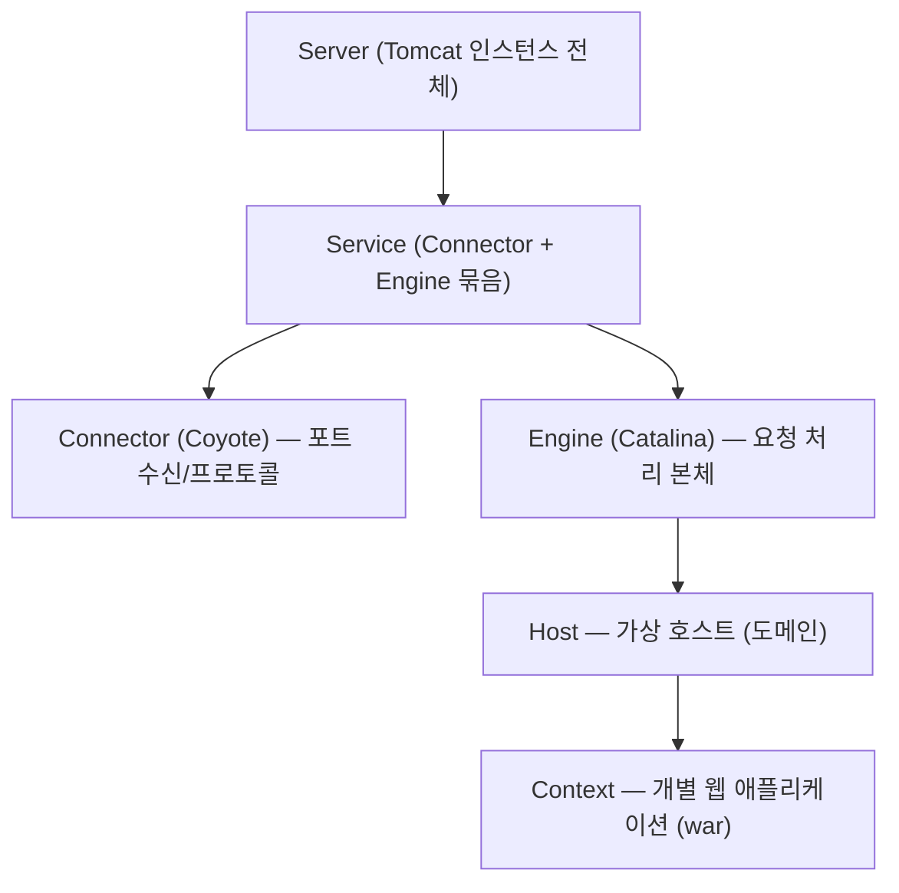
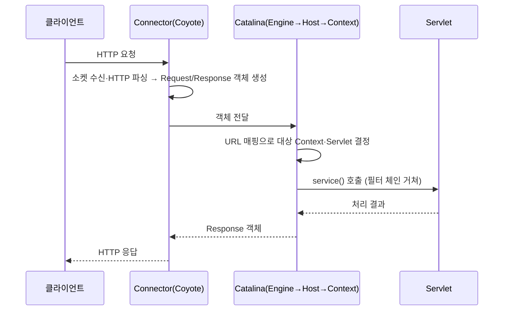

# Tomcat 기본

> 최종 업데이트: 2026-05-23 | 기준: Apache Tomcat 11.0.x (Jakarta EE 11)

## 개념

**Apache Tomcat은 Java로 작성된 오픈소스 WAS(Web Application Server)** 다. 정확히는 **서블릿 컨테이너(Servlet Container)** — 클라이언트의 HTTP 요청을 받아 자바 코드(서블릿/JSP)를 실행하고, 그 결과를 동적 콘텐츠로 만들어 돌려준다.

식당에 비유하면, **웹 서버(Nginx 등)는 미리 만들어둔 반찬을 내주는 곳**이고, **Tomcat은 주문 받아 그 자리에서 요리하는 주방**이다. 손님(요청)마다 다른 음식(응답)이 나온다.

Tomcat은 **표준 명세의 구현체**라는 점이 핵심이다. Servlet·JSP 같은 자바 표준 스펙을 따르므로, 같은 스펙을 구현한 다른 WAS(Jetty, Undertow)와 코드 호환된다.

> WAS와 웹 서버의 역할 구분은 [Web 서버와 WAS](../CS-이론/Web-서버와-WAS.md) 참고.

## 배경/역사

- **1998년 11월** — Sun Microsystems의 소프트웨어 아키텍트 **James Duncan Davidson**이 서블릿의 **레퍼런스 구현(reference implementation)**으로 처음 개발했다.
- **1999년** — Sun이 코드베이스를 **Apache Software Foundation(ASF)**에 기증, 오픈소스화. 첫 Apache 릴리스가 **Tomcat 3.0**이다.
- **이름의 유래** — Davidson이 "혼자서도 알아서 잘 살아남는(self-sufficient)" 동물을 원해 수고양이(**tom cat**)를 골랐다. 그래서 로고도 고양이다.
- **2020년 (Tomcat 10)** — Java EE가 Eclipse 재단으로 넘어가 **Jakarta EE**로 개명되면서, API 패키지가 `javax.*` → `jakarta.*`로 바뀌었다. 이 전환이 Tomcat 버전 선택의 가장 중요한 분기점이다(아래 버전 표 참고).

## 핵심 역할

| 역할 | 설명 |
|------|------|
| 서블릿/JSP 실행 | 자바 웹 컴포넌트의 생명주기 관리·실행 |
| HTTP 요청 처리 | 소켓 연결 수신 → HTTP 파싱 → 응답 전송 |
| 동적 콘텐츠 생성 | 비즈니스 로직 실행 결과를 응답으로 |
| 정적 파일 서빙 | HTML·CSS·이미지도 제공 가능(다만 전용 웹 서버보다 느림) |
| 세션·보안·커넥션 풀 | 세션 관리, 인증, JNDI 리소스 등 컨테이너 서비스 제공 |

## 내부 구조 (3대 컴포넌트)

Tomcat은 역할이 다른 세 엔진의 조합이다.

| 컴포넌트 | 별칭 | 역할 |
|----------|------|------|
| **Catalina** | 서블릿 컨테이너 | 서블릿 명세 구현, 서블릿 생명주기·요청 디스패치 담당. Tomcat의 심장 |
| **Coyote** | 커넥터(Connector) | HTTP/HTTPS·AJP 소켓 연결 수신, HTTP 요청을 자바 객체로 파싱 |
| **Jasper** | JSP 엔진 | JSP 파일을 서블릿(.java → .class)으로 변환·컴파일·실행 |

흐름으로 보면 **Coyote(네트워크) → Catalina(로직 분배) → Jasper(JSP 처리)** 순으로 협력한다.

## 서버 구성 계층

`conf/server.xml`에 정의되는 컨테이너 계층 구조다. 바깥에서 안쪽으로 요청이 좁혀 들어간다.



| 요소 | 단위 | 설명 |
|------|------|------|
| **Server** | 1개 | JVM당 하나, Tomcat 전체. 종료 포트(기본 8005) 보유 |
| **Service** | 1+ | 커넥터(들)와 엔진 하나를 묶는 단위 |
| **Connector** | 1+ | 포트별 수신 담당. HTTP(8080), HTTPS(8443), AJP(8009) |
| **Engine** | 1 | 요청을 받아 적절한 Host로 라우팅하는 처리 본체 |
| **Host** | 1+ | 가상 호스트(예: `www.a.com`, `www.b.com`) |
| **Context** | 1+ | 배포된 웹 앱 하나. URL 경로(`/app`)에 매핑 |

## 요청 처리 흐름



스레드 측면에서, Coyote는 **스레드 풀**(`maxThreads`, 기본 200)에서 워커 스레드 하나를 꺼내 요청 하나를 처리한다. 동시 요청이 풀 크기를 넘으면 대기 큐(`acceptCount`)에 쌓이고, 그마저 넘치면 연결이 거부된다 — 트래픽 튜닝의 핵심 파라미터다.

## 버전과 Jakarta EE

**Tomcat 버전 선택은 곧 패키지 네임스페이스(`javax` vs `jakarta`) 선택**이다. 애플리케이션이 어느 쪽 import를 쓰는지에 따라 호환 버전이 갈린다.

| Tomcat | Servlet | 패키지 | 플랫폼 | 최소 JDK |
|--------|---------|--------|--------|----------|
| 9.x | 4.0 | `javax.*` | Java EE 8 | JDK 8+ |
| 10.1.x | 6.0 | `jakarta.*` | Jakarta EE 10 | JDK 11+ |
| **11.0.x** (현재) | 6.1 | `jakarta.*` | Jakarta EE 11 | JDK 17+ |

- 기존 `javax.*` 코드를 Tomcat 10+에서 돌리려면 코드 수정 또는 **Apache Tomcat Migration Tool**로 변환이 필요하다.
- Spring Framework 6 / Spring Boot 3부터 `jakarta.*` 기반이라 Tomcat 10.1+와 짝이 맞는다. Spring Boot 2.x는 `javax.*`라 Tomcat 9와 맞는다.

## Spring Boot의 내장 Tomcat

요즘 백엔드는 Tomcat을 따로 설치하지 않는다. **Spring Boot가 Tomcat을 라이브러리로 내장**(embedded)해서 `java -jar app.jar` 한 줄로 WAS가 함께 뜬다(`spring-boot-starter-web`의 기본값).

```yaml
# application.yml — 내장 Tomcat 튜닝
server:
  port: 8080
  tomcat:
    threads:
      max: 200        # maxThreads
      min-spare: 10    # 최소 유지 스레드
    accept-count: 100  # 대기 큐 크기
    max-connections: 8192
```

전통적 방식(외부 Tomcat에 war 배포)과 달리, 앱과 WAS가 한 몸이라 배포·확장이 단순하다. 내장 WAS를 Jetty·Undertow로 교체하는 것도 의존성만 바꾸면 된다.

## 주요 설정

```xml
<!-- conf/server.xml — Connector 예시 -->
<Connector port="8080" protocol="HTTP/1.1"
           connectionTimeout="20000"
           maxThreads="200"
           acceptCount="100"
           redirectPort="8443" />
```

| 디렉터리/파일 | 용도 |
|---------------|------|
| `conf/server.xml` | 서버 전체 구성(Connector, Host 등) |
| `conf/web.xml` | 모든 웹 앱 공통 기본 설정 |
| `webapps/` | war 배포 위치(자동 배포 대상) |
| `logs/catalina.out` | 표준 출력·에러 통합 로그 |
| `bin/` | `startup.sh`·`shutdown.sh` 등 실행 스크립트 |

> Connector의 상세 속성은 [Connector 요소](./Connector-요소.md) 참고.

## 관련 문서

- [Web 서버와 WAS](../CS-이론/Web-서버와-WAS.md) — WAS의 위치와 웹 서버와의 역할 분담
- [Connector 요소](./Connector-요소.md) — Connector 속성 상세
- [[Nginx]] — Tomcat 앞단 리버스 프록시로 흔히 함께 구성

---

**참고 자료**

- [Apache Tomcat — Welcome](https://tomcat.apache.org/)
- [Apache Tomcat — Which Version Do I Want?](https://tomcat.apache.org/whichversion.html)
- [Apache Tomcat — Heritage](https://tomcat.apache.org/heritage.html)
- [Apache Tomcat — Wikipedia](https://en.wikipedia.org/wiki/Apache_Tomcat)
