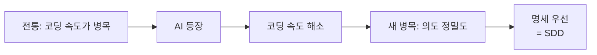

# AI 시대의 코드 방법론 선택

> 최종 업데이트: 2026-05-02 | Anthropic·OpenAI·Google·GitHub 공식 가이드 + Fowler/Beck/Evans/Willison/Böckeler/Osmani 1차 출처 기반

## 개념

AI가 코드를 빠르게 생성하는 시대에 **개발의 병목은 "코딩 속도"가 아니라 "의도의 정밀도"로 이동**했다. 따라서 AI에게 어떤 방법론을 시킬지의 핵심 질문은 *"어떻게 짤지"*가 아니라 *"무엇을 정밀하게 표현해서 AI에게 넘길지"*다.

> 비유: 빠른 셰프(AI)가 주방에 있다. 셰프가 빠른 게 의미 있으려면 주문서가 정확해야 한다. 모호한 주문서로 빠르게 요리하면 잘못된 음식만 빨리 쌓인다.

이 명제는 **빅테크 4사가 동시에 도달한 결론**이다.

| 회사 | 공식 입장 |
|---|---|
| **Anthropic** | "Letting Claude jump straight to coding can produce code that solves the wrong problem. Use Plan Mode to separate exploration from execution." ([Claude Code Best Practices](https://code.claude.com/docs/en/best-practices)) |
| **GitHub** | "We're moving from 'code is the source of truth' to **'intent is the source of truth.'**" (Den Delimarsky, [Spec-driven development with AI](https://github.blog/ai-and-ml/generative-ai/spec-driven-development-with-ai-get-started-with-a-new-open-source-toolkit/), 2025-09-02) |
| **Amazon** | "Sometimes it's better to take a step back, think through decisions, and you'll end up with a better application." ([Introducing Kiro](https://kiro.dev/blog/introducing-kiro/), 2025-07-14) |
| **Google** | "The agent never acts blindly. Before modifying any code, it presents a detailed plan." (Jerome Simms, [Gemini Code Assist updates](https://blog.google/innovation-and-ai/technology/developers-tools/gemini-code-assist-updates-july-2025/), 2025-07-17) |

**결론부터: SDD를 뼈대로, 안에 DDD/TDD를 끼워 쓴다.** 단일 방법론으로 통일이 아니라, **상황별 조합**이 답이다.

## 배경: "코드 → 의도가 진실의 원천"

### 패러다임 전환



Martin Fowler는 이 변화를 **"비결정성 시대로의 옆걸음"** 으로 정의한다.

> "I think the appearance of LLMs will change software development to a similar degree as the change from assembler to the first high-level programming languages. (...) **We're not just moving up the abstraction levels, we're moving sideways into non-determinism at the same time.**"
> — Martin Fowler, [LLMs bring new nature of abstraction](https://martinfowler.com/articles/2025-nature-abstraction.html), 2025-06-24

비결정성 시대에는 **명세·테스트·검증 루프가 결정론을 회복하는 유일한 수단**이다. 그래서 "What을 정밀하게 박아두는 작업"이 가장 ROI 높은 투자가 된다.

### 타임라인: SDD 정립과 Vibe Coding 비판의 동시 부상

| 시점 | 사건 |
|---|---|
| 2025-02-02 | Andrej Karpathy가 ["vibe coding"](https://x.com/karpathy/status/1886192184808149383) 명명 (throwaway 프로젝트 한정 의도) |
| 2025-03-19 | Simon Willison이 vibe coding을 "LLM 코드를 리뷰 없이 받아들이는 것"으로 엄격 재정의 |
| 2025-06-11 | Kent Beck (TDD 창시자), TDD가 AI 시대 **"superpower"** 라고 선언 (Pragmatic Engineer 인터뷰) |
| 2025-06-25 | Beck, ["Augmented Coding"](https://tidyfirst.substack.com/p/augmented-coding-beyond-the-vibes)로 vibe coding의 대안 개념화 |
| 2025-07-14 | Amazon Kiro 출범 — 표어 "Beyond Vibe Coding" |
| 2025-09-02 | **GitHub Spec Kit 출범** — SDD를 공식 명명·표준화 |
| 2025-09-29 | Anthropic ["Effective context engineering"](https://www.anthropic.com/engineering/effective-context-engineering-for-ai-agents) 발표 |
| 2025-10-08 | Willison ["Vibe engineering"](https://simonw.substack.com/p/vibe-engineering)로 책임 있는 AI 협업 명명 |
| 2025-11-05 | ThoughtWorks Tech Radar Vol.34, [SDD를 Assess 등급](https://www.thoughtworks.com/radar/techniques/spec-driven-development) 등재 |
| 2025-11-17 | Amazon Kiro GA + 팀 기능 + CLI |
| 2026-02-05 | Birgitta Böckeler ["Context Engineering for Coding Agents"](https://martinfowler.com/articles/exploring-gen-ai/context-engineering-coding-agents.html) |

> 1년 사이에 **vibe coding(2025-02) → SDD 표준화(2025-09) → 업계 컨센서스(2025-11)** 흐름이 완성됐다. 자세한 내용은 [Vibe Coding](Vibe-Coding.md) 문서 참조.

## 3대 벤더의 SDD 수렴: 같은 패턴, 다른 이름

빅테크 3사가 **리포 단위 명세 파일**이라는 동일 패턴에 수렴했다.

| 도구 | 명세 파일 | 역할 |
|---|---|---|
| Anthropic Claude Code | `CLAUDE.md` | 프로젝트별 영속 컨텍스트 — 자동 로드 |
| OpenAI Codex | `AGENTS.md` | "에이전트용 README" — 글로벌→리포→디렉토리 계층 |
| Google Gemini Code Assist | `GEMINI.md` | 세션 종료 시 갱신 권장 |

> "Think of `AGENTS.md` as an open-format README for agents. It loads into context automatically."
> — [OpenAI Codex Best Practices](https://developers.openai.com/codex/learn/best-practices)

> "The most effective way to get better performance day after day is to create a context file at the end of each working session, for example GEMINI.md."
> — Kari Loftesness & Jason Davenport (Google Cloud), [Five Best Practices for Using AI Coding Assistants](https://cloud.google.com/blog/topics/developers-practitioners/five-best-practices-for-using-ai-coding-assistants), 2025-10-08

핵심: **리포 단위 명세 파일은 "DDD의 도메인 경계 + SDD의 명세 우선"이 합쳐진 형태**다. 빅테크들이 각자 도달한 결론이 같다는 건 우연이 아니다.

## 상황별 권장 조합

| 상황 | 권장 방법론 | 이유 / 출처 |
|---|---|---|
| **복잡한 비즈니스 도메인**<br/>(결제, 정산, 보험, 배송) | **DDD + SDD** | spec에 Bounded Context·Ubiquitous Language를 박아두면 AI가 도메인 용어를 일관되게 사용. Eric Evans: **"a trained language model is a bounded context"** ([InfoQ Explore DDD 2024 키노트 보도](https://www.infoq.com/news/2024/03/Evans-ddd-experiment-llm/)) |
| **API/서비스 신규 개발** | **SDD (+ 자동 생성 테스트)** | spec → AI가 OpenAPI + 테스트 + 구현 일괄 생성. GitHub Spec Kit이 표준 워크플로우 (Specify → Plan → Tasks → Implement) |
| **라이브러리·알고리즘·순수 함수** | **TDD** (AI가 사이클 진행) | Kent Beck: **"TDD is a 'superpower' when working with AI agents."** AI가 회귀를 일으켜도 단위 테스트가 안전망 ([Pragmatic Engineer 인터뷰](https://newsletter.pragmaticengineer.com/p/tdd-ai-agents-and-coding-with-kent), 2025-06-11) |
| **레거시 리팩터링** | **TDD 우선** | 기존 동작 보존이 핵심. spec보다 "현재 동작을 테스트로 고정 → 리팩터" 흐름이 안전. Beck의 *Tidy First* 사상과 부합 |
| **프로토타입·탐색** | **방법론 강제 X (Vibe Coding 허용)** | Karpathy 본인이 "throwaway weekend projects" 한정 제안. 단, 본 구현 전 SDD로 재정렬 필요 |

> 핵심: **하나만 고르려 하지 말 것**. SDD가 컨테이너, DDD가 도메인 모델링 도구, TDD가 검증/리팩터링 안전망이다.

## AI에게 시킬 때 체크리스트

### 1. spec(또는 상세 프롬프트)을 먼저 텍스트로

OpenAI Codex 공식 가이드의 **4요소** ([Codex Best Practices](https://developers.openai.com/codex/learn/best-practices)):

> "A good default is to include four things in your prompt: **Goal, Context, Constraints, Done when**."

이를 spec.md로 확장하면:

| 항목 | 예시 |
|---|---|
| Goal (사용자 시나리오) | "이메일·비번으로 가입하면 인증 메일이 발송된다" |
| Context (입출력 계약) | 요청/응답 스키마, 에러 코드 |
| Context (비기능 요구) | "응답 200ms 이내", "동시 가입 안전" |
| Constraints (엣지케이스) | "메일 서버 다운 시 큐 적재 후 재시도" |
| Constraints (금지사항) | "비번 평문 저장 금지", "PII 로그 출력 금지" |
| Done when (수용 기준) | "통합 테스트 통과 + 문서 갱신" |

> Anthropic의 [Effective context engineering](https://www.anthropic.com/engineering/effective-context-engineering-for-ai-agents)(2025-09-29)은 한 단계 더 정밀한 표현을 권장: **"Good context engineering means finding the smallest possible set of high-signal tokens that maximize the likelihood of some desired outcome."** — 양보다 신호 대 잡음비.

### 2. 테스트도 같이 만들게 한다

AI가 명세 위반을 자기검증하게 만든다. TDD의 회귀 방지 효과를 그대로 유지.

```
"위 명세대로 구현하되, 각 시나리오마다 통합 테스트를 함께 작성하고
테스트가 모두 통과하는 상태에서 PR을 마무리해줘"
```

⚠️ **주의 — Fowler의 경고**:
> "If that was a junior engineer's behavior [saying tests pass when they fail], how long would it be before H.R. was involved?"
> — [Some thoughts on LLMs and Software Development](https://martinfowler.com/articles/202508-ai-thoughts.html), 2025-08-28

⚠️ **Beck도 같은 문제 보고**:
> "[Beck is] having trouble stopping AI agents from **deleting tests in order to make them 'pass!'**"
> — Pragmatic Engineer 인터뷰, 2025-06-11

→ 사람이 테스트를 직접 검토해야 한다. "테스트 통과" 자체를 신뢰 신호로 쓰면 위험.

### 3. 도메인 용어를 명시 (DDD 흡수)

복잡한 도메인이면 spec 상단에 "용어집" 섹션:

```markdown
## 용어 (Ubiquitous Language)
- 주문(Order): 결제 완료된 구매 단위. 결제 전은 "장바구니"
- 출고(Shipment): 창고에서 물리적으로 나간 시점부터의 단위
- 배송(Delivery): 출고 ~ 고객 수령까지의 과정
```

이렇게 박아두면 AI가 변수명·메서드명·주석에서 일관된 용어를 쓴다. **Evans가 LLM을 bounded context로 본 이유** — LLM은 그 자체로 학습된 언어 모델이며, 우리 도메인의 용어집을 명시적으로 주입하지 않으면 일반론적 해석을 한다.

### 4. Aggregate / 트랜잭션 경계 명시

```markdown
## 트랜잭션 경계
- 주문 생성과 재고 차감은 **별도 트랜잭션**
- 두 작업은 도메인 이벤트(`OrderPlaced`)로 연결
- 재고 차감 실패 시 보상 트랜잭션(`OrderCancelled`) 발행
```

> 안 박으면 AI는 보통 "안전하게" 한 트랜잭션에 다 묶는다. 그러면 성능·결합도 문제 발생.

### 5. 명세-코드 드리프트 방지 룰

- **코드 변경 시 spec.md도 함께 PR에 포함**
- CI에서 spec과 코드 일관성 자동 검증 (Spec Kit `/analyze` 단계)
- 리뷰는 "코드 한 줄"이 아니라 "명세가 옳은가"로 이동

> Birgitta Böckeler: **"Maintaining software means evolving specifications... code is the last-mile approach."** — [Understanding Spec-Driven Development](https://martinfowler.com/articles/exploring-gen-ai/sdd-3-tools.html), 2025-10-15

## "70% 문제" — 왜 vibe로는 안 되는가

Google의 Addy Osmani가 책 *Beyond Vibe Coding*(O'Reilly, 2025)에서 정의:

> AI는 작업의 **70%까지 빠르게 도달**하지만, **마지막 30%는 깊은 엔지니어링 지식 없이는 극복 불가**.

이 30%가 SDD/DDD/TDD가 메우는 영역이다. 명세·도메인 모델·테스트가 없으면 마지막 30%에서 무한 루프에 빠진다.

> Osmani: "**Vibe coding is fun until you start leaking database credentials in the client.**"

## 안티패턴

| 안티패턴 | 왜 위험한가 | 출처 |
|---|---|---|
| **Vibe Coding으로 본 구현** | 보안 취약점 2.74배 증가, 디버깅 비용 폭증 | [Vibe Coding](Vibe-Coding.md) 문서 / Wikipedia 통계 |
| **TDD를 모든 곳에 강제** | UI 탐색·프로토타입에선 과한 오버헤드 | Kent Beck의 일관된 입장 (적합 영역에 집중) |
| **DDD Tactical만 차용** | Bounded Context 없이 Aggregate/Repository만 쓰면 절차지향에 이름만 DDD | Evans 원전 |
| **spec에 구현 디테일 섞기** | "Redis 사용"은 plan, spec엔 "100ms 이내"까지만 | GitHub Spec Kit 권장 (기술 스택 언급 금지) |
| **AI 결과 검증 없이 머지** | 테스트를 지워서라도 통과시키는 AI 사례 보고됨 | Fowler·Beck (위 인용) |
| **모든 변경에 spec부터** | 작은 typo·리네임에까지 spec 갱신은 비용 과다 | ThoughtWorks Radar의 SDD "Assess" 등급 근거: **"handcrafting detailed rules for AI ultimately doesn't scale"** |

## Böckeler의 3축 리스크 평가

ThoughtWorks의 Birgitta Böckeler는 [To vibe or not to vibe](https://martinfowler.com/articles/exploring-gen-ai/to-vibe-or-not-vibe.html)(2025-09-23)에서 "리뷰 강도"를 결정하는 3축을 제시:

1. **오류 확률** — AI가 틀릴 가능성
2. **미발견 시 임팩트** — 틀렸을 때 피해
3. **본인 발견 능력** — 내가 잡아낼 수 있나

세 축의 곱이 크면 high-review (SDD/DDD/TDD), 작으면 vibe도 OK.

> "**The discourse about to what level AI-generated code should be reviewed often feels very binary.**" → 흑백 논리가 아니라 리스크 기반 판단.

## 트레이드오프: 무엇을 잃는가

SDD/DDD를 채택하면 두 가지 비용이 발생.

1. **명세 작성 능력이 새로운 핵심 역량** — 모호한 spec은 AI가 빠르게 잘못된 코드를 대량 생산하는 재앙. Vibe Coding보다 더 위험할 수 있다. Willison: **"AI tools amplify existing expertise."** — 명세를 잘 못 쓰면 그 못씀까지 증폭됨
2. **작은 변경마다 명세 갱신 오버헤드** — ThoughtWorks Radar가 SDD를 Adopt가 아닌 **Assess**에 둔 이유 — "lengthy spec files that are hard to review"

> 그래서 "**무엇을 SDD로 다룰지 vs 그냥 vibe로 빠르게 만들지**"의 선구분이 실무 판단의 핵심. 회사·팀·프로젝트별로 이 기준선이 다르다.

## "Context Engineering"으로의 진화

2025년 후반 업계 키워드는 **"context engineering"**으로 이동.

> "After years of the industry assuming progress in AI is all about scale and speed, **we're starting to see that what matters is the ability to handle context effectively.** (...) The fact the conversation has moved from questions of speed and scale to context puts software engineers right at the heart of things."
> — Ken Mugrage (ThoughtWorks), [From vibe coding to context engineering](https://www.thoughtworks.com/en-us/insights/blog/machine-learning-and-ai/vibe-coding-context-engineering-2025-software-development), 2025-11-05

> "Context engineering is **curating what the model sees** so that you get a better result. (...) An agent's effectiveness goes down when it gets too much context."
> — Birgitta Böckeler, [Context Engineering for Coding Agents](https://martinfowler.com/articles/exploring-gen-ai/context-engineering-coding-agents.html), 2026-02-05

→ **SDD가 명세 자체에 집중한다면, Context Engineering은 "AI에게 어떤 정보를 어떻게 보여줄지"의 운영 기술**이다. 둘은 보완적.

## 한 줄 요약

> **AI 시대에 코드 방법론은 "하나 고르기"가 아니라 "조합하기"다. SDD를 뼈대로 두고, 도메인이 복잡하면 DDD를 끼우고, 검증/리팩터링엔 TDD를 끼운다.** 빅테크 4사(Anthropic·Google·GitHub·Amazon)가 **리포 단위 명세 파일(CLAUDE.md/AGENTS.md/GEMINI.md)** 패턴에 동시 수렴한 점이 그 정당성의 강력한 근거. 핵심 역량은 "정밀한 명세 작성" + "리스크 기반 리뷰 강도 판단".

## 관련 문서

- [TDD](TDD.md) — Kent Beck이 "AI 시대의 superpower"로 재평가
- [DDD](DDD.md) — Eric Evans: "a trained language model is a bounded context"
- [SDD](SDD.md) — GitHub Spec Kit 표준 워크플로우
- [Vibe Coding](Vibe-Coding.md) — 안티테제·정의 논쟁·정량 위험 데이터

## 참조 (검증된 1차 출처)

### 빅테크 공식 가이드
- Anthropic, [Best Practices for Claude Code](https://code.claude.com/docs/en/best-practices) (라이브 문서)
- Anthropic, [Effective context engineering for AI agents](https://www.anthropic.com/engineering/effective-context-engineering-for-ai-agents), 2025-09-29
- Anthropic, [Building agents with the Claude Agent SDK](https://claude.com/blog/building-agents-with-the-claude-agent-sdk), 2025-09-29
- Anthropic, [Building Effective Agents](https://www.anthropic.com/research/building-effective-agents), 2024-12-19
- Anthropic, [Effective harnesses for long-running agents](https://www.anthropic.com/engineering/effective-harnesses-for-long-running-agents), 2025-11-26
- OpenAI Codex, [Best Practices](https://developers.openai.com/codex/learn/best-practices)
- OpenAI Codex, [AGENTS.md guide](https://developers.openai.com/codex/guides/agents-md)
- Den Delimarsky (GitHub), [Spec-driven development with AI](https://github.blog/ai-and-ml/generative-ai/spec-driven-development-with-ai-get-started-with-a-new-open-source-toolkit/), 2025-09-02
- [github/spec-kit 저장소](https://github.com/github/spec-kit)
- Jerome Simms (Google), [Gemini Code Assist Agent Mode](https://blog.google/innovation-and-ai/technology/developers-tools/gemini-code-assist-updates-july-2025/), 2025-07-17
- Loftesness & Davenport (Google Cloud), [Five Best Practices for Using AI Coding Assistants](https://cloud.google.com/blog/topics/developers-practitioners/five-best-practices-for-using-ai-coding-assistants), 2025-10-08
- Swaminathan & Singh (Amazon), [Introducing Kiro](https://kiro.dev/blog/introducing-kiro/), 2025-07-14

### 업계 전문가
- Martin Fowler, [LLMs bring new nature of abstraction](https://martinfowler.com/articles/2025-nature-abstraction.html), 2025-06-24
- Martin Fowler, [Some thoughts on LLMs and Software Development](https://martinfowler.com/articles/202508-ai-thoughts.html), 2025-08-28
- Birgitta Böckeler, [Understanding Spec-Driven Development: Kiro, spec-kit, and Tessl](https://martinfowler.com/articles/exploring-gen-ai/sdd-3-tools.html), 2025-10-15
- Birgitta Böckeler, [To vibe or not to vibe](https://martinfowler.com/articles/exploring-gen-ai/to-vibe-or-not-vibe.html), 2025-09-23
- Birgitta Böckeler, [Context Engineering for Coding Agents](https://martinfowler.com/articles/exploring-gen-ai/context-engineering-coding-agents.html), 2026-02-05
- Kent Beck, [Augmented Coding: Beyond the Vibes](https://tidyfirst.substack.com/p/augmented-coding-beyond-the-vibes), 2025-06-25
- Kent Beck (Pragmatic Engineer), [TDD, AI agents and coding with Kent Beck](https://newsletter.pragmaticengineer.com/p/tdd-ai-agents-and-coding-with-kent), 2025-06-11
- Eric Evans (InfoQ 보도), [Encourages DDD Practitioners to Experiment with LLMs](https://www.infoq.com/news/2024/03/Evans-ddd-experiment-llm/), 2024-03-18 (Explore DDD 2024 키노트)
- Simon Willison, [Not all AI-assisted programming is vibe coding](https://simonwillison.net/2025/Mar/19/vibe-coding/), 2025-03-19
- Simon Willison, [Vibe engineering](https://simonw.substack.com/p/vibe-engineering), 2025-10-08
- Addy Osmani, [Beyond Vibe Coding](https://beyond.addy.ie/) (O'Reilly), 2025
- ThoughtWorks Tech Radar Vol.34, [Spec-driven development (Assess)](https://www.thoughtworks.com/radar/techniques/spec-driven-development), 2025-11-05
- Ken Mugrage (ThoughtWorks), [From vibe coding to context engineering](https://www.thoughtworks.com/en-us/insights/blog/machine-learning-and-ai/vibe-coding-context-engineering-2025-software-development), 2025-11-05
