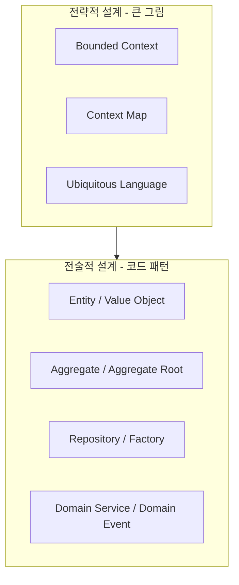

# DDD (Domain-Driven Design, 도메인 주도 설계)

> 최종 업데이트: 2026-05-02 | Eric Evans 원전 기준 / 현대 마이크로서비스 실무 반영

## 개념

DDD는 **소프트웨어의 핵심 복잡성이 비즈니스 도메인에 있다는 전제 아래, 도메인 모델을 코드의 1급 시민으로 두고 모델을 중심으로 설계·구현하는 방법론**이다.

> 비유: 다국어 회사에서 사업부와 개발부가 같은 단어를 다른 의미로 쓰면 혼란이 생긴다. DDD는 "이 도메인의 공식 사전"을 만들고 코드·문서·대화에서 일관되게 그 단어만 쓰자는 약속이다.

핵심 명제: **소프트웨어의 구조는 도메인 전문가의 머릿속 모델을 반영해야 한다.** 데이터베이스 스키마나 프레임워크가 아니라 도메인이 설계의 중심.

## 배경/역사

DDD는 **Eric Evans**가 2003년 저서 *Domain-Driven Design: Tackling Complexity in the Heart of Software*(국내 번역서: 『도메인 주도 설계』)에서 정립한 방법론이다.

- **2003** Eric Evans가 컨설팅 경험을 정리해 *DDD: Tackling Complexity in the Heart of Software* 출간 — "Blue Book"으로 통칭
- **2004~2010** 객체지향 설계 커뮤니티에서 점진적 확산. 패턴 카탈로그(Aggregate, Repository 등)가 표준 어휘로 자리잡음
- **2013** Vaughn Vernon의 *Implementing Domain-Driven Design*(IDDD, "Red Book") 출간 — 실전 구현 갭 보완
- **2014~2015** **마이크로서비스(MSA)** 부상과 함께 DDD가 재조명. *Bounded Context*가 서비스 경계 정의의 표준 도구가 됨
- **2016** Vernon의 *Domain-Driven Design Distilled*("Green Book") — 입문서로 대중화
- **2020년대** Event Storming, CQRS, Event Sourcing과 결합. AI 코드 생성 시대에는 명세(SDD)와 도메인 모델의 정합성이 새 화두

> Evans 본인도 컨설턴트로서 다양한 프로젝트의 실패 경험에서 패턴을 추출했다. "Blue Book"은 패턴 카탈로그라기보다 **사고방식**을 다룬 책에 가깝다.

## 두 축: Strategic Design vs Tactical Design



| 축 | 다루는 것 | 주 사용자 |
|---|---|---|
| **Strategic Design** | 도메인을 어떻게 나누고 경계를 그을지 | 아키텍트, PO, 도메인 전문가 |
| **Tactical Design** | 한 컨텍스트 안에서 객체를 어떻게 짤지 | 개발자 |

> 많은 팀이 Tactical(Entity/Repository)만 가져다 쓰고 Strategic을 빼먹어 "DDD를 흉내낸 Anemic Domain"이 된다. **Strategic이 본체**다.

## Strategic Design 핵심 개념

### Ubiquitous Language (보편 언어)

> 도메인 전문가, 개발자, 코드, 문서가 **같은 단어를 같은 뜻으로** 사용한다는 약속.

비유: "주문(Order)"이 결제 시스템에선 "결제 대상", 배송 시스템에선 "배송 단위"로 다르게 쓰이면 충돌. 컨텍스트별로 정의를 못박고, 그 안에서는 일관되게 사용.

### Bounded Context (경계 컨텍스트)

> 하나의 모델이 일관되게 적용되는 **명시적 경계**.

| 개념 | 설명 |
|---|---|
| 컨텍스트 | "이 모델이 유효한 영역" (예: 결제, 배송, 회원) |
| 경계 | 컨텍스트 간 모델은 다를 수 있다 — 같은 "주문"이라도 의미가 다름 |
| 컨텍스트 매핑 | 컨텍스트 간 관계 정의 (Customer/Supplier, Conformist, Anti-Corruption Layer 등) |

> **MSA의 서비스 경계 ≒ Bounded Context**. 마이크로서비스를 도메인 기준으로 쪼개는 표준이 됐다.

### Context Map (컨텍스트 맵)

여러 Bounded Context가 어떻게 통합·의존하는지 그림으로 표현. 대표 패턴:

| 패턴 | 의미 |
|---|---|
| **Shared Kernel** | 두 컨텍스트가 일부 모델을 공유 (위험) |
| **Customer/Supplier** | 한쪽이 상위, 한쪽이 하위 — 상위 변경에 하위가 적응 |
| **Conformist** | 하위 컨텍스트가 상위 모델을 그대로 따름 |
| **Anti-Corruption Layer (ACL)** | 외부 모델을 내부로 들이면서 변환·격리하는 레이어 |
| **Open Host Service** | 명시적 프로토콜로 외부에 모델 공개 (REST API 등) |
| **Published Language** | OHS의 표준 언어 (OpenAPI, JSON Schema 등) |

## Tactical Design 핵심 패턴

### Entity vs Value Object

| 구분 | Entity | Value Object |
|---|---|---|
| 정체성 | ID로 식별 | 속성값으로 식별 |
| 가변성 | 가변 (상태 변화 추적) | 불변 권장 |
| 비교 | `id` 비교 | 모든 필드 비교 |
| 예시 | `User`, `Order` | `Money`, `Address`, `Email` |

```java
// Entity — 같은 ID면 같은 사용자
public class User {
    private final UserId id;
    private String name;
    public boolean equals(Object o) { return id.equals(((User)o).id); }
}

// Value Object — 같은 금액·통화면 같은 Money
public record Money(BigDecimal amount, Currency currency) {}
```

### Aggregate / Aggregate Root

> **불변식(invariant)을 함께 지켜야 하는 객체들의 묶음**. 외부에서는 Aggregate Root를 통해서만 접근.

```java
// Order가 Aggregate Root, OrderLine은 Aggregate 내부
public class Order {
    private final OrderId id;
    private final List<OrderLine> lines;

    public void addLine(Product p, int qty) {
        if (totalAmount().plus(p.price().times(qty)).isOverLimit())
            throw new OrderLimitExceeded();
        lines.add(new OrderLine(p, qty));
    }
}
```

규칙:
- 외부에서 `OrderLine`을 직접 수정하지 않는다 → 항상 `Order.addLine()` 경유
- Aggregate 간 참조는 **ID로만** (객체 참조 X) — 트랜잭션 경계와 일관성 단위
- 트랜잭션 1개 = Aggregate 1개 (강한 일관성). 여러 Aggregate는 Domain Event로 연결 (결과적 일관성)

### Repository

> Aggregate 단위로 영속화/조회를 추상화. **Aggregate Root만 Repository를 가진다.**

```java
public interface OrderRepository {
    Order findById(OrderId id);
    void save(Order order);
}
```

DB 기술(JPA, MyBatis 등)은 구현체에서 처리. 도메인은 인터페이스만 안다.

### Domain Service

> 어느 한 Entity에 자연스럽게 속하지 않는 도메인 로직.

예: "환율을 조회해서 결제 금액을 변환" — `Order`도 `Currency`도 단독으로 가지기 어색한 책임.

### Domain Event

> 도메인에서 일어난 의미있는 사건(과거형). 다른 Aggregate/Bounded Context에 비동기로 전파.

```java
public record OrderPlaced(OrderId id, Money total, Instant occurredAt) {}
```

> Event Sourcing, CQRS, Saga 패턴의 기반. MSA 간 통신의 표준이 됨.

## 핵심 안티패턴

| 안티패턴 | 설명 |
|---|---|
| **Anemic Domain Model** | Entity가 getter/setter만 있고 로직은 Service에 — DDD를 흉내낸 절차지향 |
| **God Aggregate** | Aggregate 경계가 너무 커서 동시성 충돌·성능 문제 발생 |
| **Generic Repository 남용** | `Repository<T>`로 모든 Entity 조회 — Aggregate Root 구분 무시 |
| **Tactical만 적용** | Bounded Context/Ubiquitous Language 없이 패턴만 차용 |
| **DB 스키마 우선 설계** | 도메인 모델이 ERD에 끌려다님 — 객체-관계 임피던스 미스매치 악화 |
| **DDD를 작은 프로젝트에 강제** | CRUD 위주 단순 시스템엔 과한 오버헤드 |

## TDD / SDD / DDD 비교

| 방식 | 우선순위 | 핵심 산출물 | 주 효용 |
|---|---|---|---|
| **TDD** | 테스트가 먼저 | 테스트 + 코드 | 회귀 방지, 설계 강제 |
| **SDD** | 명세가 먼저 | spec.md + AI 생성 코드 | AI 시대 의도-코드 동기화 |
| **DDD** | 도메인 모델이 먼저 | 모델 + 코드 + 보편 언어 | 복잡한 비즈니스 도메인 정복 |

> 셋은 배타적이지 않다. **DDD로 모델을 잡고 → SDD로 명세화 → TDD로 구현**하는 식의 결합이 일반적. 특히 DDD ↔ SDD는 보완적("도메인 모델"이 명세의 일부가 됨).

## MSA와의 관계

DDD는 **MSA 서비스 경계 정의의 표준 도구**다.

| 단계 | DDD 역할 |
|---|---|
| 도메인 식별 | Event Storming으로 도메인 이벤트 추출 |
| 컨텍스트 분리 | Bounded Context 단위로 서비스 후보 도출 |
| 통신 설계 | Context Map으로 서비스 간 관계 명시 (ACL, OHS 등) |
| 데이터 분리 | Aggregate 경계 = 트랜잭션 경계 = 서비스 DB 경계 |

> "MSA를 어떻게 나눌까?"라는 질문의 가장 강력한 답이 **Bounded Context로 나누라**다.

## Event Storming (실전 도구)

Alberto Brandolini가 고안한 **워크숍 기법**. 큰 벽에 포스트잇으로 도메인 이벤트를 시간순 나열하고, 명령(Command)·집계(Aggregate)·정책(Policy)을 붙여 도메인 모델을 협업으로 발견.

| 색 | 의미 |
|---|---|
| 주황 | Domain Event (과거형: "주문이 생성되었다") |
| 파랑 | Command (현재형: "주문 생성") |
| 노랑 | Aggregate / Actor |
| 보라 | Policy (이벤트 → 다음 명령 트리거 규칙) |
| 분홍 | Hot Spot (논쟁/모호 지점) |

> 한국에서는 "이벤트 스토밍 워크숍"으로 통하며, MSA 전환 프로젝트에서 단골로 쓰임.

## 백엔드 개발자 관점 실무 포인트

- **Aggregate를 작게** — 동시성 충돌과 트랜잭션 비용을 줄임. "Aggregate 간은 ID 참조 + 결과적 일관성"
- **JPA와 충돌 주의** — `@OneToMany` cascade, lazy loading이 Aggregate 경계를 흐림. 명시적 fetch 전략과 분리된 트랜잭션 권장
- **Application Service / Domain Service 구분** — Application은 트랜잭션·인증·트리거 조합, Domain은 도메인 규칙
- **Repository는 Aggregate Root당 1개** — `OrderLineRepository` 같은 건 안티패턴
- **Domain Event는 트랜잭션 커밋 후 발행** — 미커밋 상태 이벤트가 외부로 새면 일관성 깨짐. Spring `ApplicationEventPublisher` + `@TransactionalEventListener(AFTER_COMMIT)` 또는 Outbox 패턴
- **Bounded Context 간 통신은 ACL 통해** — 외부 모델을 내부 모델로 변환하는 어댑터 계층 둠

## 한 줄 요약

> **DDD = "복잡한 비즈니스 도메인을 정복하려면, 도메인 전문가와 같은 언어(Ubiquitous Language)로 도메인 모델을 코드의 중심에 두고 명시적 경계(Bounded Context)로 나눠 설계하라"는 방법론.** Eric Evans가 2003년 정립했고, MSA 시대에 서비스 경계 정의의 표준이 됐다. Tactical 패턴(Aggregate, Repository 등)만 차용하면 의미 없고 Strategic 사고가 본체.

## 관련 문서

- [TDD](TDD.md) — 테스트 주도 개발
- [SDD](SDD.md) — 명세 주도 개발 (AI 시대)
- [MSA란](../../MSA/MSA란.md)

## 참조

- Eric Evans, *Domain-Driven Design: Tackling Complexity in the Heart of Software* (2003) — Blue Book
- Vaughn Vernon, *Implementing Domain-Driven Design* (2013) — Red Book
- Vaughn Vernon, *Domain-Driven Design Distilled* (2016) — Green Book
- Alberto Brandolini, *Introducing EventStorming* (2017)
- [DDD Reference (Eric Evans 무료 PDF)](https://www.domainlanguage.com/ddd/reference/)
- [Martin Fowler: BoundedContext](https://martinfowler.com/bliki/BoundedContext.html)
