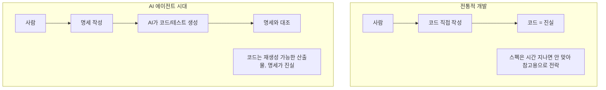
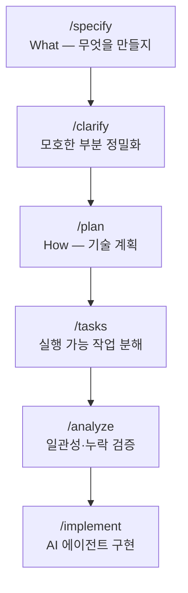

# SDD (Spec-Driven Development, 명세 주도 개발)

> 최종 업데이트: 2026-05-02 | GitHub Spec Kit / Claude Code·Cursor 등 AI 코딩 에이전트 시대 기준

## 개념

SDD는 **"코드를 짜기 전에 자연어/구조화된 명세(spec)를 먼저 작성하고, 그 명세를 단일 진실 공급원(Single Source of Truth)으로 삼아 코드·테스트·문서를 생성·검증하는 개발 방식"**이다.

> 비유: 건축에서 도면을 먼저 그리고 시공하는 것. 옛날에는 도면이 "참고용"이었다면, SDD는 도면이 **"실행 가능한 계약서"**가 된다. 코드와 도면이 어긋나면 도면이 정답.

핵심 명제: **"사람의 일은 What을 정밀하게 쓰는 것, How(코드)는 AI/도구가 만든다."**

## 배경/역사

"스펙 먼저"라는 발상은 새것이 아니지만(워터폴, 형식 명세, API-First 등), **2024~2026년에 다시 부상한 결정적 계기는 AI 코딩 에이전트의 일반화**다.



- **2010년대** API-First, OpenAPI/Swagger로 스펙 우선 흐름 확산 (특정 도메인)
- **2022~2023** ChatGPT/Copilot로 AI 코드 생성이 실용 단계 진입, "프롬프트 엔지니어링" 부상
- **2024** AI 에이전트(Cursor, Devin, Claude Code 등) 등장으로 "사람의 입력 품질"이 결과를 좌우한다는 인식 확산
- **2025** **GitHub가 "Spec Kit" 오픈소스 공개** — SDD를 가장 구체적으로 정의한 공식 워크플로우. Amazon이 Kiro를, 다른 벤더도 유사 프레임워크 발표
- **2026** "Vibe Coding"의 안티테제로 SDD가 엔터프라이즈에서 채택 시작

> SDD를 단독 발명한 인물은 없지만, GitHub의 Den Delimarsky·Hrishi Olickel 등이 Spec Kit으로 방법론을 정형화한 것이 사실상의 "출범"으로 평가된다.

## 5단계 워크플로우 (GitHub Spec Kit 기준)



| 단계 | 산출물 | 핵심 질문 |
|---|---|---|
| /specify | spec.md | "사용자에게 무슨 가치를 주는가?" |
| /clarify | 갱신된 spec.md | "여기 모호한데 어떻게 처리?" |
| /plan | plan.md | "어떤 기술/구조로 구현할까?" |
| /tasks | tasks.md | "어떤 순서로 누가 작업?" |
| /analyze | 검증 리포트 | "명세 ↔ 계획 ↔ 작업이 일관되나?" |
| /implement | 코드 + 테스트 | "명세 준수 여부 자동 검증" |

각 단계가 **이전 산출물에 종속**되어, 명세가 바뀌면 하위 산출물이 자동으로 다시 정렬된다.

## TDD / BDD / SDD 비교

| 방식 | 먼저 쓰는 것 | 주 독자 | 산출물 | 시대 배경 |
|---|---|---|---|---|
| **TDD** (Test-Driven) | 실패하는 테스트 | 개발자 | 테스트 + 코드 | 2000년대 XP/애자일 |
| **BDD** (Behavior-Driven) | 행위 시나리오 (Given/When/Then) | 개발자 + 기획 | Gherkin + 코드 + 테스트 | 2010년대 협업 강조 |
| **SDD** (Spec-Driven) | 자연어 명세 + 구조화 의도 | 사람 + **AI** | 명세 + 코드 + 테스트 + 문서 | 2020년대 중후반 AI 에이전트 |

핵심 차이:
- TDD/BDD는 **사람이 코드를 짠다는 전제**. 테스트/시나리오가 코드 작성의 가이드.
- SDD는 **AI가 코드를 생성한다는 전제**. 명세가 AI의 입력이자 검증 기준.

> SDD ⊃ BDD ⊃ TDD가 아니라, **AI 시대에 맞게 재정의된 "명세 우선" 방식**. TDD를 부정하지 않고, SDD 안에 테스트 명세가 포함되는 형태.

## 명세에 들어가는 것

좋은 spec.md의 구성 요소.

| 항목 | 예시 |
|---|---|
| 사용자 시나리오 | "이메일·비번으로 가입하면 인증 메일이 발송된다" |
| 기능 요구사항 | "비번은 10자 이상, 영·숫·특 조합" |
| 비기능 요구사항 | "응답 200ms 이내, 99.9% 가용성" |
| 입출력 계약 | 요청/응답 스키마, 에러 코드 |
| 엣지케이스 | "동시 가입 시도", "메일 서버 다운" |
| 제약/금지사항 | "비번 평문 저장 금지", "PII 로그 출력 금지" |
| 수용 기준 (AC) | "통합 테스트 통과 + 문서 갱신" |

> Spec Kit은 명세에서 **"기술 스택 언급 금지"**를 권장. 그건 `/plan` 단계의 일이라 분리. 명세는 What에만 집중하게 강제하는 장치.

## 실무 흐름 예시

### 전통 방식
```
티켓: "회원가입 API 만들어줘"
  ↓
개발자: 코드 작성 → 테스트 작성 → PR
  ↓
리뷰어: 코드를 보고 "왜 이렇게 짰지?" 추측
```

### SDD 방식
```
spec.md 작성:
  - 시나리오: 이메일/비번 가입, 인증 메일 발송
  - 검증 규칙: 이메일 중복 불가, 비번 10자+
  - 비기능: 응답 200ms, 동시 가입 안전
  - 엣지: 메일 서버 다운 시 큐 적재 후 재시도
  ↓
plan.md: Spring Boot + JPA + Redis 큐로 메일 발송
  ↓
tasks.md: 엔티티 → 리포지토리 → 서비스 → 컨트롤러 → 테스트
  ↓
AI 구현 → 명세-코드 자동 검증
  ↓
PR 머지 조건: 코드 변경 시 spec.md도 함께 업데이트
```

## 장점

| 장점 | 설명 |
|---|---|
| 의도와 코드의 동기화 | 스펙이 "살아있는 문서"가 됨. 코드만 보고 의도 추측할 일 감소 |
| AI에 정밀한 컨텍스트 | 두루뭉술한 프롬프트 대신 정밀 입력 → 결과 품질 향상 |
| 리뷰가 본질 중심 | "이 줄 왜?"가 아니라 "이 명세가 옳은가?"로 이동 |
| 재생성 가능 | 명세 그대로 다른 언어/스택으로 이식 용이 |
| 온보딩 가속 | 신규 입사자가 코드보다 spec.md를 먼저 읽으면 됨 |
| 테스트 자동 정렬 | 명세 변경 → 테스트 재생성 |

## 단점 / 주의

| 단점 | 설명 |
|---|---|
| 명세 작성 자체가 어렵다 | "정밀하게 쓰는 능력"이 새 핵심 역량 — 모호하면 AI 결과도 모호 |
| 오버헤드 | 작은 변경에도 명세부터 손대는 비용 |
| 명세-코드 드리프트 | 코드만 급히 고치고 명세 그대로면 다시 "참고용"으로 전락 |
| 도구 미성숙 | 표준화된 명세 포맷 부재. Spec Kit·Kiro·사내 솔루션 난립 |
| 부적합 영역 | 탐색적 프로토타이핑·리서치 코드에는 과함 |
| 명세 자체의 버그 | 잘못된 명세 → 잘못된 코드를 빠르게 대량 생산 |

## 안티패턴

- **"AI가 알아서 해주겠지" 마인드** — 명세가 모호하면 결과도 모호. 자유도가 큰 만큼 부담도 큼.
- **명세에 구현 디테일 섞기** — `Redis 사용`은 plan.md, spec.md엔 `100ms 이내 응답` 정도까지만.
- **PR마다 새 spec.md** — 기존 명세를 갱신해야 진실의 단일성이 유지됨.
- **AI 결과를 검증 없이 머지** — 명세 준수 검증·테스트가 SDD의 핵심. 그게 빠지면 그냥 "Vibe Coding".

## 인접 개념

| 용어 | 관계 |
|---|---|
| **Vibe Coding** | "느낌으로" AI에 던져 짜는 정반대 스타일. SDD의 안티테제 |
| **API-First / Contract-First** | OpenAPI 스펙 우선. SDD의 API 도메인 갈래 |
| **형식 명세 (TLA+, Alloy)** | 수학적 정밀 명세. SDD의 학술적 선조 |
| **Living Documentation** | 코드와 자동 동기화되는 문서. SDD 결과물에 가까움 |
| **DDD (Domain-Driven Design)** | 도메인 모델 우선 — SDD와 충돌 없음, 보완적 |
| **TDD (Test-Driven Development)** | 테스트 먼저 — SDD 안에 테스트 명세가 포함되는 형태 |

## 도구 생태계

| 도구 | 설명 |
|---|---|
| **GitHub Spec Kit** | SDD 워크플로우 표준안. Claude Code·Cursor·Copilot 등과 결합 가능 |
| **Amazon Kiro** | AWS의 SDD 지향 IDE (2025) |
| **Cursor / Claude Code** | AI 에이전트. SDD의 `/implement` 단계 실행 |
| **OpenAPI Generator** | API 도메인 SDD의 고전 |
| **Pact** | Consumer-Driven Contract Testing — 마이크로서비스 SDD |

## 백엔드 개발자 관점 실무 포인트

- **API 단위로 시작** — 이미 API-First가 익숙하다면 자연스러운 확장
- **spec.md를 PR에 포함** — 코드 변경 ↔ 명세 변경 동시 리뷰
- **테스트를 명세에 인용** — `AC: 통합테스트 X 통과` 형태
- **모호함 발견 시 /clarify 강제** — AI에 바로 던지기 전 한 번 더 정밀화
- **CI에 명세-코드 일관성 검증** — 도구가 미성숙하므로 사내 스크립트로라도

## 한 줄 요약

> **SDD = "AI가 코드를 짜는 시대에, 사람의 핵심 역할은 명세를 정밀하게 쓰는 것"이라는 방법론.** 명세가 단일 진실 공급원이고, 코드·테스트·문서는 거기서 파생된다. GitHub Spec Kit이 대표 구현이며, TDD/BDD를 대체한다기보다 AI 시대에 맞게 재정의한 형태.

## 관련 문서

- [TDD](TDD.md) — 테스트 주도 개발
- [DDD](DDD.md) — 도메인 주도 설계

## 참조

- [GitHub Spec Kit](https://github.com/github/spec-kit)
- [Spec-Driven Development with AI (GitHub Blog)](https://github.blog/ai-and-ml/generative-ai/spec-driven-development-with-ai-get-started-with-a-new-open-source-toolkit/)
- [Amazon Kiro](https://kiro.dev/)
- [API-First 가이드 (OpenAPI Initiative)](https://www.openapis.org/)
