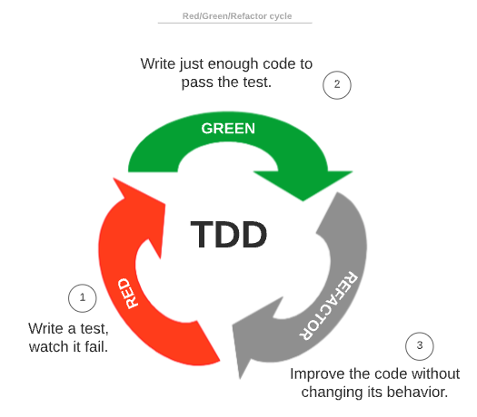
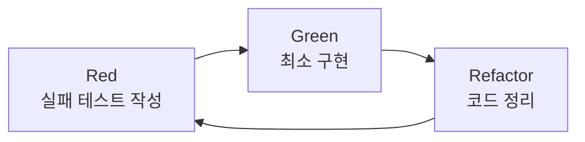

# TDD (Test-Driven Development, 테스트 주도 개발)

> 최종 업데이트: 2026-05-02 | Kent Beck 원전 / 현대 실무 기준

## 개념

TDD는 **프로덕션 코드를 작성하기 전에 실패하는 테스트부터 먼저 쓰고**, 그 테스트를 통과시키는 방향으로 코드를 만들어가는 개발 방법론이다.

> 비유: 요리 레시피를 먼저 정해놓고 재료를 사러 가는 것. "어떻게 동작해야 하는가"를 테스트로 못박아두고, 구현은 거기에 맞춰 따라간다.

핵심 명제: **요구사항을 테스트로 표현**하고, 코드는 그 테스트를 만족시키기 위한 최소한의 도구로 본다. 테스트 코드 자체가 살아있는 명세 문서가 된다.

## 배경/역사

TDD는 **Kent Beck**이 1990년대 후반 Extreme Programming(XP)의 핵심 실천법으로 정립했고, 2003년 저서 *Test-Driven Development: By Example*(국내 번역서: 『테스트 주도 개발』)로 대중화됐다.

- **1990년대 중반** Kent Beck이 Smalltalk 시절 SUnit(최초의 xUnit 계열 단위 테스트 프레임워크) 개발하며 "테스트 먼저" 발상 정착
- **1999** Beck의 *Extreme Programming Explained* 출간. TDD가 XP 12개 실천법 중 하나로 명시
- **2003** *Test-Driven Development: By Example* 출간 — Red/Green/Refactor 사이클 정형화
- **2014** Ruby on Rails 창시자 DHH의 ["TDD is dead. Long live testing."](http://david.heinemeierhansson.com/2014/tdd-is-dead-long-live-testing.html) 글로 TDD 회의론 부상. Beck/Martin Fowler와의 ["Is TDD Dead?"](https://martinfowler.com/articles/is-tdd-dead/) 대담 시리즈로 이어짐
- **2020년대** AI 코드 생성 시대에 SDD(Spec-Driven Development)의 검증 도구로 재평가

## Red → Green → Refactor 사이클



| 단계 | 색 | 하는 일 | 코드 품질 |
|---|---|---|---|
| **Red** | 🔴 | 실패하는 테스트를 먼저 작성 (아직 구현이 없으니 당연히 실패) | — |
| **Green** | 🟢 | 테스트를 통과시키는 **최소한의 코드**만 작성 | 지저분해도 OK |
| **Refactor** | 🔵 | 테스트 통과 상태를 유지하며 코드 정리 | 깔끔하게 |

이 사이클을 보통 **몇 분 단위**로 빠르게 반복한다. "큰 기능 하나"가 아니라 "작은 행동 하나"가 단위.

> Red 단계에서 테스트가 처음에 통과하면 오히려 잘못된 것 — 테스트 자체가 의도와 다르게 작성됐다는 신호다.



## 짧은 코드 예시

**Red** — 아직 `add` 함수가 없으므로 컴파일/실행 실패.
```java
@Test
void add_두_수를_더하면_합이_반환된다() {
    assertThat(Calculator.add(2, 3)).isEqualTo(5);
}
```

**Green** — 통과시키는 최소 코드. 일반화 X, 하드코딩이라도 OK.
```java
public class Calculator {
    public static int add(int a, int b) { return a + b; }
}
```

**Refactor** — 통과 상태를 유지하며 정리. 이 예시는 더 정리할 게 없으니 다음 사이클로.

## TDD가 지향하는 것

| 효과 | 설명 |
|---|---|
| **설계 강제** | 테스트하기 어려운 코드는 곧 결합도가 높은 코드 — 자연스럽게 모듈이 작아지고 의존성이 명확해짐 |
| **회귀 방지** | 리팩터링/기능 추가 시 기존 테스트가 안전망 역할 |
| **명세 역할** | 테스트 코드 자체가 "이 함수는 이렇게 동작한다"는 살아있는 문서 |
| **과잉 구현 방지** | 테스트가 요구하는 만큼만 작성 → YAGNI(You Aren't Gonna Need It) 자연 준수 |
| **요구사항 집중** | Service/Repository를 테스트하는 게 아니라 **요구사항(Functional Requirement)을 테스트** |

## 단점 / 주의

| 단점 | 설명 |
|---|---|
| 일정 압박 | 일정 안에 TDD까지 해내기는 처음엔 매우 어려움. 숙련도와 팀 합의 필요 |
| 테스트 작성 비용 | 단순 CRUD나 GUI 등 가치 대비 비용이 높은 영역 존재 |
| 잘못된 단위 | "구현 디테일"을 테스트하면 리팩터링마다 테스트가 깨짐. **행위(behavior)** 단위로 작성해야 함 |
| Mock 과다 | 의존성을 전부 mock 처리하면 통합 시점에 깨지는 사례 — sociable test와 균형 |
| 학습 곡선 | "최소 구현"의 감각, 리팩터링 타이밍 등 몸에 익히는 데 시간 |

## 인접 개념 비교

| 방식 | 먼저 쓰는 것 | 단위 | 시대 |
|---|---|---|---|
| **TDD** (Test-Driven) | 실패하는 단위 테스트 | 함수/클래스 | 2000년대 XP |
| **BDD** (Behavior-Driven) | Given/When/Then 시나리오 | 사용자 행위 | 2010년대 |
| **ATDD** (Acceptance Test-Driven) | 수용 테스트 | 비즈니스 요구 | 2010년대 |
| **SDD** (Spec-Driven) | 자연어 명세 | 기능 단위 | 2020년대 AI 시대 |

> TDD는 **구현 프로세스(implementation process)**에 집중한다는 점에서 BDD/SDD와 결이 다르다. BDD/SDD는 "무엇을"에 가깝고, TDD는 "어떻게 작은 단위로 만들어 갈 것인가"에 가깝다.

## 애자일과의 관계

TDD는 **Agile/XP 사상의 산물**이다. 작은 단위로 자주 인도(deliver)하고, 변화에 기민하게 대응한다는 가치가 전제. 한 번에 거대한 완성본을 만들지 않고, **작은 단위의 완성을 테스트로 판단**한다.

> "작은 단위"의 의미가 핵심 — 한 사이클이 길어지면 TDD의 이점(빠른 피드백, 안전한 리팩터링)이 사라진다.

## "TDD is Dead?" 논쟁

2014년 DHH가 "TDD가 시스템 설계를 왜곡한다"며 비판. 핵심 쟁점:
- **단위 테스트 과잉** → 통합 시점의 진짜 문제를 못 잡음
- **Mock 남용** → 테스트 통과해도 프로덕션에서 깨짐
- **설계 왜곡** → 테스트 가능성이 우선되며 자연스러운 설계가 비틀림

Beck/Fowler 측 반론은 "TDD가 죽은 게 아니라 **단위 테스트 도그마가 죽었다**" — 적절한 단위(unit test ↔ integration test)와 sociable test의 균형이 답이라는 논지.

## 백엔드 개발자 관점 실무 포인트

- **Service 계층부터 시작** — Repository/Controller보다 도메인 로직이 있는 Service가 TDD 효과 큼
- **Test Double 신중히** — Stub/Mock/Fake 차이 이해. Mockito 남용보다 Fake 객체나 Testcontainers로 실제 의존성 사용 검토
- **테스트 이름은 행위로** — `add_두_수를_더하면_합이_반환된다` 같이 *상황 → 결과* 표현 (`Test-Naming-Conventions.md` 참조)
- **JUnit5 + AssertJ 조합** — `assertThat`의 가독성이 TDD 사이클 속도에 영향
- **CI에 회귀 테스트 강제** — 로컬 통과만으로 안 됨. PR 단위로 자동 실행

## 한 줄 요약

> **TDD = "실패하는 테스트 → 최소 구현 → 리팩터링"을 짧은 사이클로 반복하며 코드를 키우는 방식.** 테스트가 설계를 강제하고, 회귀를 막고, 살아있는 명세가 된다. Kent Beck이 XP에서 정립했으며 2026년 현재도 SDD/AI 코드 생성과 결합되며 진화 중.

## 관련 문서

- [SDD (Spec-Driven Development)](SDD.md) — AI 시대의 명세 우선 방법론
- [DDD (Domain-Driven Design)](DDD.md) — 도메인 모델 우선 설계
- [테스트 코드 개론](../../TestCode/테스트-코드-개론.md)
- [Test Naming Conventions](../../TestCode/Test-Naming-Conventions.md)
- [TestDouble](../../TestCode/TestDouble.md)
- [JUnit5](../../TestCode/JUnit5/)
- [AssertJ](../../TestCode/AssertJ.md)

## 참조

- Kent Beck, *Test-Driven Development: By Example* (2003)
- Martin Fowler & Kent Beck, ["Is TDD Dead?"](https://martinfowler.com/articles/is-tdd-dead/) 대담 시리즈 (2014)
- [Baeldung: Unit Testing vs TDD](https://www.baeldung.com/cs/unit-testing-vs-tdd)
- [Baeldung: BDD Guide](https://www.baeldung.com/cs/bdd-guide#tdd)
- [TDD는 죽었는가? (jinson 블로그)](https://jinson.tistory.com/271)
