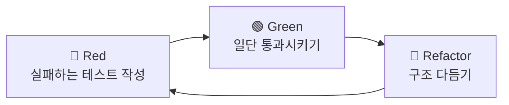

# 리팩토링 (Refactoring)

> 최종 업데이트: 2026-05-23 | 기준: Martin Fowler 『Refactoring』 2nd Edition(2018)

## 개념

**리팩토링은 코드의 겉으로 드러나는 동작(observable behavior)은 그대로 둔 채, 내부 구조만 더 이해하기 쉽고 고치기 싸게 바꾸는 작업**이다. 결과값과 기능은 1도 변하지 않고, 오직 코드의 "짜임새"만 좋아진다.

집을 예로 들면, 벽을 헐고 방을 늘리는 게 아니라 — 어질러진 방을 정리하고, 물건을 제자리에 두고, 안 쓰는 가구를 버리는 것이다. 사는 사람 입장(=프로그램 사용자)에선 달라진 게 없지만, 다음에 청소(=수정)하기는 훨씬 쉬워진다.

Martin Fowler의 정의는 명사와 동사 두 가지로 나뉜다.

| 품사 | 정의 |
|------|------|
| 명사 (refactoring) | 겉보기 동작은 유지하면서 더 이해하기 쉽고 수정 비용이 싸지도록 가하는, **하나의 작은 구조 변경** |
| 동사 (to refactor) | 그런 작은 리팩토링들을 **연달아 적용**해 소프트웨어를 재구성하는 행위 |

핵심은 **"작게, 동작을 보존하며"**다. 한 번에 구조를 뒤엎는 건 리팩토링이 아니라 재작성(rewrite)에 가깝다.

## 배경/역사

용어 **refactoring**은 **re-(다시) + factor(인수)**의 합성어로, 수학의 **인수분해(factoring)**에서 빌려온 비유다. `x² + 5x + 6`을 `(x+2)(x+3)`으로 쪼개듯, 프로그램도 논리적으로 깔끔한 덩어리로 다시 쪼갠다는 뜻이다.

- **1990년 9월** — **William(Bill) Opdyke**와 **Ralph Johnson**이 논문 *"Refactoring: An aid in designing application frameworks and evolving object-oriented systems"*에서 이 용어를 처음 활자로 사용했다. 둘이 산책하며 당시 유행하던 "Software Factory(소프트웨어 공장)" 개념을 이야기하다가, 소프트웨어 개발은 제조(manufacturing)보다 설계(design)에 가깝다고 보고 **"Software Refactory"**라 부르자 한 데서 `re-` 접두사가 붙었다.
- **1992년** — Opdyke가 Ralph Johnson 지도 아래 박사논문 *"Refactoring Object-Oriented Frameworks"*를 발표. 리팩토링을 정식 소프트웨어 공학 기법으로 다룬 최초의 심층 연구다.
- **개념의 뿌리** — Fowler가 추적해보니 정확한 발원지는 아무도 못 짚었고, **Smalltalk 커뮤니티**와 **Forth 커뮤니티**에서 독립적으로 비슷한 은유가 자라났다(인쇄물 최초 언급은 Leo Brodie의 1984년 책 *Thinking Forth*).
- **1999년** — **Martin Fowler**가 책 *『Refactoring: Improving the Design of Existing Code』*를 펴내며 현장에 완전히 대중화. 이미 몇 년 전 **익스트림 프로그래밍(XP)**에 핵심 실천법으로 흡수된 상태였다. (2018년 2판은 예제 언어를 Java → JavaScript로 교체)

## 리팩토링이 아닌 것

가장 흔한 오해가 "코드 손대는 거 = 리팩토링"이다. 동작이 바뀌면 리팩토링이 아니다. 둘을 절대 섞지 않는 게 안전의 핵심이다.

| 작업 | 동작 변화 | 리팩토링인가? |
|------|-----------|----------------|
| 리팩토링 | 없음 (보존) | ✅ |
| 기능 추가 | 있음 (새 동작) | ❌ |
| 버그 수정 | 있음 (틀린 동작 → 맞게) | ❌ |
| 성능 최적화 | 없음(동작 보존)하지만 목적이 다름 | △ 별개 활동으로 구분 |

성능 최적화도 동작은 보존하지만, 리팩토링이 "가독성·구조"를 위해 때로 성능을 양보한다면 최적화는 그 반대다. 그래서 별도 활동으로 본다.

## 언제 하는가

리팩토링은 따로 시간 잡아 몰아 하는 이벤트가 아니라, **개발 흐름에 스며드는 습관**이다.

### Two Hats (두 개의 모자)

Kent Beck의 비유. 개발자는 늘 두 모자 중 하나만 쓴다.

- **기능 추가 모자** — 새 기능을 더한다. 기존 코드 구조는 건드리지 않고 테스트만 추가/통과시킨다.
- **리팩토링 모자** — 구조만 다듬는다. 기능은 더하지 않고 테스트도 새로 추가하지 않는다(기존 테스트는 계속 통과).

중요한 건 **한 번에 한 모자만** 쓰는 것. 기능 짜다 구조가 거슬리면 잠깐 리팩토링 모자로 갈아쓰고, 끝나면 다시 기능 모자로 돌아온다. 두 모자를 동시에 쓰면 "이게 기능 변경 때문인지 구조 변경 때문인지" 추적이 안 돼 버그의 온상이 된다.

### 타이밍 가이드

- **삼진 규칙(Rule of Three)** — 같은 코드가 세 번째 등장하면 그때 리팩토링한다(한 번은 그냥, 두 번째는 중복을 감수, 세 번째에 정리).
- **기능 추가 직전** — 기능을 넣기 쉽게 먼저 바닥을 닦는다(*"먼저 쉽게 만들고, 그 다음 쉬운 변경을 한다"* — Kent Beck).
- **보이스카웃 규칙** — 코드를 처음 봤을 때보다 조금이라도 더 깨끗하게 두고 떠난다.

## 코드 스멜 (Code Smell)

"여기 리팩토링이 필요하다"는 신호를 **코드 스멜(악취)** 이라 부른다. Kent Beck과 Fowler가 정리한 용어로, "버그는 아닌데 뭔가 구린 냄새가 나는" 코드 패턴이다.

| 스멜 | 증상 | 대표 처방 |
|------|------|-----------|
| Long Method | 함수 하나가 너무 길다 | Extract Function |
| Large Class | 클래스가 너무 많은 책임을 진다 | Extract Class |
| Duplicated Code | 같은 코드가 여기저기 | Extract Function / Pull Up Method |
| Long Parameter List | 매개변수가 줄줄이 | Introduce Parameter Object |
| Feature Envy | A 클래스 메서드가 B 데이터만 주무른다 | Move Method |
| Primitive Obsession | 모든 걸 String·int로만 표현 | Replace Primitive with Object |
| Shotgun Surgery | 하나 고치려면 여러 곳을 동시에 손대야 함 | Move Method/Field로 응집 |
| Magic Number | 의미 모를 상수가 코드에 박혀있음 | Replace Magic Number with Constant |

## 대표 리팩토링 기법

각 기법은 작고, 동작을 보존하며, IDE가 자동화해주는 경우가 많다(IntelliJ `Ctrl+T`).

### Extract Function (함수 추출)

긴 함수에서 의미 단위를 별도 함수로 빼낸다. 가장 자주 쓰이는 기법.

```java
// Before
void printOwing(Invoice invoice) {
    printBanner();
    double outstanding = invoice.getOutstanding();
    System.out.println("name: " + invoice.getCustomer());
    System.out.println("amount: " + outstanding);
}

// After — "무엇을 하는지"가 함수명으로 드러난다
void printOwing(Invoice invoice) {
    printBanner();
    double outstanding = invoice.getOutstanding();
    printDetails(invoice, outstanding);
}
void printDetails(Invoice invoice, double outstanding) {
    System.out.println("name: " + invoice.getCustomer());
    System.out.println("amount: " + outstanding);
}
```

### Rename (이름 변경)

가장 저평가된, 그러나 가장 강력한 리팩토링. 좋은 이름은 주석을 없앤다.

```java
// Before
int d; // elapsed time in days
// After
int elapsedTimeInDays;
```

### Replace Temp with Query (임시변수를 질의 함수로)

```java
// Before
double basePrice = quantity * itemPrice;
if (basePrice > 1000) ...

// After — 계산 로직을 함수로, 중복 계산도 재사용
if (basePrice() > 1000) ...
double basePrice() { return quantity * itemPrice; }
```

### Replace Magic Number with Constant (매직 넘버 제거)

```java
// Before
double potentialEnergy(double mass, double height) {
    return mass * 9.81 * height;
}
// After
static final double GRAVITATIONAL_CONSTANT = 9.81;
double potentialEnergy(double mass, double height) {
    return mass * GRAVITATIONAL_CONSTANT * height;
}
```

### Decompose Conditional (조건문 분해)

```java
// Before
if (date.before(SUMMER_START) || date.after(SUMMER_END))
    charge = quantity * winterRate + winterServiceCharge;
else
    charge = quantity * summerRate;

// After — 조건과 분기 본문을 각각 함수로 추출해 의도를 노출
if (notSummer(date)) charge = winterCharge(quantity);
else charge = summerCharge(quantity);
```

## 리팩토링과 테스트

**리팩토링의 전제 조건은 신뢰할 수 있는 테스트다.** 동작이 보존됐다는 걸 보장하는 게 테스트이기 때문이다. 테스트 없는 리팩토링은 "동작이 안 바뀐다고 믿는 도박"일 뿐이다.

그래서 리팩토링은 **TDD**의 핵심 한 축이다. TDD의 Red-Green-Refactor 사이클에서 세 번째 단계가 바로 리팩토링이다.



- **Red** — 아직 없는 기능의 테스트를 먼저 쓴다 (실패).
- **Green** — 지저분해도 좋으니 일단 통과시킨다.
- **Refactor** — 통과 상태를 **테스트라는 안전망** 삼아 구조를 정리한다. 매번 작게 고치고 테스트를 돌려, 깨지면 즉시 직전으로 되돌린다.

작은 단위로 자주 커밋하는 것도 같은 이유다 — 잘못되면 마지막 정상 지점으로 싸게 돌아가기 위해서다.

## 관련 문서

- [[TDD]] — Red-Green-Refactor 사이클의 마지막 단계가 리팩토링
- [[DDD]] — 도메인 모델을 점진적으로 정련하는 과정에서 리팩토링이 필수
- [코드리뷰](../코드리뷰/코드리뷰-읽을거리.md) — 코드 스멜을 발견하는 또 하나의 통로

---

**참고 자료**

- [bliki: Etymology Of Refactoring — Martin Fowler](https://martinfowler.com/bliki/EtymologyOfRefactoring.html)
- [Code refactoring — Wikipedia](https://en.wikipedia.org/wiki/Code_refactoring)
- [What is Refactoring? — Agile Alliance](https://agilealliance.org/glossary/refactoring/)
- [William Opdyke — Wikipedia](https://en.wikipedia.org/wiki/William_Opdyke)
