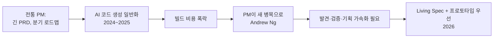

# AI 시대의 IT 기능 기획

> 최종 업데이트: 2026-05-03 | McKinsey·Bain·BCG·a16z·Sequoia 보고서 + Lenny/Cagan/Torres/Doshi/Andrew Ng/Cat Wu 1차 인용 기반

## 개념

AI가 코드를 빠르게 만드는 시대에 **IT 기능 기획(PM·PO 영역)도 동시에 변하고 있다**. 핵심은 두 가지:

1. **PM의 작업 단위가 "확정성 정의"에서 "발견 가속화"로 이동**
2. **PRD가 "사람이 읽는 산출물"에서 "AI가 읽는 명세(spec)"로 변화**

> Cat Wu (Head of Product, Claude Code, Anthropic), [Product management on the AI exponential](https://claude.com/blog/product-management-on-the-ai-exponential), 2026-03-19:
> **"The product manager's job is to create clarity in the ambiguity that rapid model progress creates."**

> Kai Xin Tai (Senior PM, Datadog), 같은 글:
> **"A PM's craft has shifted from defining certainty upfront to accelerating discovery."**

> 비유: 예전 PM은 "건물 설계도를 완벽히 그려서 시공팀에 넘기는 사람"이었다. 지금은 "변하는 지반 위에서 매주 새 프로토타입을 띄워보며 사람들의 반응으로 진짜 짓고 싶은 건물을 발견하는 사람"이다.

## 배경/역사: 무엇이 변했나

### 패러다임 전환의 트리거



> Andrew Ng (Lenny Rachitsky 인용, [X 게시물](https://x.com/lennysan/status/1943773031459172360), 2025-07):
> **"Product management is becoming the new bottleneck. (...) I don't see product management work becoming faster at the same speed as engineering."**

엔지니어링이 빨라질수록, 무엇을 만들지 결정하는 단계가 상대적으로 느려져 새 병목이 된다.

### 타임라인

| 시점 | 사건 |
|---|---|
| 2023-06 | McKinsey, GenAI 거시 보고서 발표 — 가치의 75%가 4개 영역(고객 운영·마케팅·**소프트웨어 엔지니어링**·R&D)에 집중 |
| 2023-09-20 | Sequoia, ["Generative AI's Act Two"](https://sequoiacap.com/article/generative-ai-act-two/) — "기술 신기함"에서 "고객 가치 증명"으로 시장 전환 |
| 2023-10-11 | Vercel v0 출시 — PM/디자이너 프로토타이핑 도구의 시작점 |
| 2023-11 | Claire Vo가 [ChatPRD](https://www.chatprd.ai/) 출시 (사이드 프로젝트, 첫 주 수천 명 가입) |
| 2024-04-09 | Lenny Rachitsky, [How AI will impact PM](https://www.lennysnewsletter.com/p/how-ai-will-impact-product-management) — "PM의 가치는 저수준 작업이 아닌 고수준 판단으로 이동" |
| 2024-05-31 | McKinsey, **PM 생산성 +40%** 통제 실험 결과 발표 |
| 2024-10-04 | Bolt.new 출범 — 30일 만에 $4M ARR, 5개월 만에 $40M ARR. PM 명시 타깃 |
| 2024-10-15 | Dovetail 3.0 출시 — "World-First AI Customer Insights Hub" |
| 2025-01-22 | Lovable, "PMs who use AI will replace those who don't" 슬로건 채택 |
| 2025-05-27 | Marty Cagan, ["AI Product Management 2 Years In"](https://www.svpg.com/ai-product-management-2-years-in/) — "AI는 형편없는 로드맵을 더 빨리 만들게 해줄 뿐" |
| 2025-07 | Andrew Ng, "PM이 새로운 병목" 발언 (Lenny 인용) |
| 2025-09-02 | GitHub Spec Kit 출범 — `/specify`가 PM 산출물로 자리잡기 시작 |
| 2025-11-06 | General Assembly, **PM 98%가 AI 사용** 1차 통계 발표 |
| 2026-02-03 | Vercel new v0 — "non-engineer가 production code 배포 가능" 명시 |
| 2026-03-19 | Anthropic, [Product management on the AI exponential](https://claude.com/blog/product-management-on-the-ai-exponential) — PM 작업 리듬 4대 시프트 |
| 2026-04-07 | a16z, [Growth Engineer Fellowship](https://www.a16z.news/p/introducing-the-a16z-growth-engineer) — **"PM·엔지니어·growth가 한 역할로 수렴"** 공식화 |

## 정량 통계: 얼마나 바뀌고 있나

| 출처 | 발행일 | 핵심 수치 |
|---|---|---|
| McKinsey, [GenAI for SW product time-to-market](https://www.mckinsey.com/industries/technology-media-and-telecommunications/our-insights/how-generative-ai-could-accelerate-software-product-time-to-market) | 2024-05-31 | PM 40명 통제 실험: **PM 생산성 +40%, 출시시간 -5%, 직원경험 +100%**. PRD 작성 같은 콘텐츠 작업 -40% 시간, 데이터 수집은 -15%만 |
| McKinsey, [State of AI 2025](https://www.mckinsey.com/capabilities/quantumblack/our-insights/the-state-of-ai) | 2025-11 (1,993명) | 조직의 **88%**가 AI 도입(↑78%→88%), 그러나 "AI 고성과자"는 **6%만**. 제품 개발 영역에서 **73%는 아직 AI 에이전트 미사용** |
| Bain, [From Pilots to Payoff](https://www.bain.com/insights/from-pilots-to-payoff-generative-ai-in-software-development-technology-report-2025/) | 2025-09-23 | 코드 작성·테스트는 컨셉→출시 시간의 **25~35%만**. AI 어시스턴트 단독 +10~15%, **라이프사이클 전체 적용 시 +25~30%** |
| BCG, [Role of AI in Reshaping Product Innovation](https://www.bcg.com/publications/2025/role-of-ai-reshaping-product-innovation) | 2025 | 혁신 사이클 최대 **30% 가속**. **10/20/70 법칙**: 알고리즘 10% / 데이터 20% / **사람·프로세스 70%** |
| Stack Overflow, [Developer Survey 2025](https://survey.stackoverflow.co/2025/ai) | 2025-12-29 | 개발자 **84%**가 AI 사용·도입 예정, 그러나 **프로젝트 기획에 AI 미사용 응답 69%**. AI 신뢰도는 29%로 -11%p 하락 |
| General Assembly, [AI and PM Survey](https://generalassemb.ly/blog/ai-and-product-management-survey/) | 2025-11-06 (PM 117명) | **PM 98%가 AI 사용**, 평균 **하루 11회**, 상위는 25회. 그러나 직무 특화 교육 **39%만** 수강. **66%가 사내 미승인 도구 사용 (shadow AI)** |
| Anthropic, [PM on AI Exponential](https://claude.com/blog/product-management-on-the-ai-exponential) | 2026-03-19 | 16개월 동안 Sonnet 3.5 → Opus 4.6 task-completion 능력 **약 41배 향상** |

> 핵심 메시지: **PM 영역은 "AI를 쓰는가"가 아니라 "잘 쓰는가"가 이미 차별화 요소**. 98%가 쓰지만 6%만 고성과. 70%는 사람·프로세스 재설계가 결정적.

## 5가지 주요 변화

### 변화 1. PRD → Living Spec (실행 가능한 명세)

전통 PRD는 **"한 번 쓰고 슬랙에 던지는 문서"**였다. 이제는 AI 에이전트가 직접 읽고 구현하는 **Living Spec**으로 재정의된다.

> GitHub Spec Kit, [spec-driven.md](https://github.com/github/spec-kit/blob/main/spec-driven.md):
> **"When a product manager updates acceptance criteria, implementation plans automatically flag affected technical decisions."**

> 같은 글:
> **"Production metrics and incidents don't just trigger hotfixes—they update specifications for the next regeneration."**

PRD가 산출물이 아니라 **양방향 피드백을 받는 살아있는 문서**가 된다. 자세한 SDD 워크플로우는 [SDD](../개발문화/개발방법론/SDD.md) 참조.

### 변화 2. Discovery가 PM 핵심 일로 부상

빌드가 싸지면서 PM의 시간이 **"무엇을 만들지 발견하는 일"로 더 많이 이동**한다.

> Teresa Torres, [Interview Coach 출시 글](https://www.producttalk.org/2025/08/customer-interview-coach/), 2025-08-06:
> **"I'm firmly in the 'AI should augment (not replace) humans at work' camp. (...) we need to be talking with humans."**

AI는 인터뷰 합성/요약을 자동화하지만, **"인간과 인간 사이 공감 형성"은 자동화 안 된다**는 일관된 입장. Discovery는 오히려 PM의 핵심 차별화로 부상.

> Marty Cagan: *"이것은 놀라운 시대다. Product Discovery에 있어 이보다 좋았던 적이 없다."*

### 변화 3. PM-Engineer-Designer 경계 흐려짐

PM이 직접 v0/Bolt/Lovable로 인터랙티브 프로토타입을 만들고, 엔지니어가 PRD `/specify`를 함께 쓴다.

> a16z, [Growth Engineer Fellowship 발표](https://www.a16z.news/p/introducing-the-a16z-growth-engineer), 2026-04-07:
> **"The roles of a growth marketer, PM, and engineer are all collapsing into one. (...) Modern growth leaders can hold the business equation in their head, and when they need to, spin up 20 AI agents and custom workflows overnight to get the right outcomes."**

> Niklas Hatje (Group PM, Lovable 고객 인용):
> **"Having a visual prototype helps explore details and find edge cases much easier than writing specifications."**

스펙 글쓰기보다 **인터랙티브 프로토타입이 발견의 매개**가 된다.

### 변화 4. "Demo-First over Documentation-First"

> Anthropic, [PM on AI Exponential](https://claude.com/blog/product-management-on-the-ai-exponential), 2026-03-19 — 4가지 작업 리듬 시프트:
> 1. 장기 로드맵 → **짧은 스프린트 + 사이드 퀘스트**
> 2. 문서 → **프로토타입·데모**
> 3. 정적 출시 → **모델 릴리즈마다 재방문**
> 4. 엔지니어드 우회 → **단순 구현** (모델이 좋아져 우회가 불필요해짐)

> 같은 글: **"When a product manager can go from idea to working prototype in an afternoon, the gap between 'what if we tried…' and 'here, try this' nearly disappears."**

### 변화 5. PM의 가치 = AI가 못하는 것

| AI가 잘하는 것 | PM의 차별화 영역 |
|---|---|
| PRD 초안 작성 | **고객 인사이트 발굴** (raw data 직접 청취) |
| 구조화·일관성 검사 | **우선순위 판단·정치 조율** |
| 사용자 인터뷰 합성 | **이해관계자 정렬·buy-in 확보** |
| 메트릭 모니터링·요약 | **도메인 직관·product sense** |
| 프로토타입 생성 | **무엇이 "옳은 문제"인지 결정** |

> Shreyas Doshi, [X 게시물](https://x.com/shreyas/status/1957841513142268286), 2025-08:
> **"While AI will get there eventually, right now it isn't good enough for the depth & judgment I'd expect from senior PMs."**

> Marty Cagan, [AI PM 2 Years In](https://www.svpg.com/ai-product-management-2-years-in/), 2025-05-27:
> **"People are using it to come up with product roadmaps, and they still have their crappy roadmaps. They're just doing them faster."**

→ **AI는 판단력을 자동화하지 못한다. 형편없는 PM에게 AI를 주면 형편없음만 가속된다.**

## 도구 생태계

| 카테고리 | 도구 | 핵심 가치 | 출처 |
|---|---|---|---|
| **PRD/스펙 자동화** | ChatPRD | 자연어→PRD/1-pager/user story 자동 생성, "CPO 코칭" | [chatprd.ai](https://www.chatprd.ai/) — Claire Vo (전 LaunchDarkly CPO), 2023-11 |
| | GitHub Spec Kit `/specify` | PM의 What/Why → 구조화된 스펙으로 변환 | [github/spec-kit](https://github.com/github/spec-kit) |
| **Living Doc·운영 허브** | Linear AI / Agent | 이슈 트리아지·릴리스 노트·프로젝트 업데이트 자동화 | [Linear Changelog](https://linear.app/changelog), 2026-02~04 |
| | Notion AI / Agent | 워크스페이스 횡단 검색·자동 문서 생성, Custom Agents | [Notion AI](https://www.notion.com/product/ai) |
| **고객 피드백 Discovery** | Productboard AI | 피드백→기능 자동 매핑, 트렌드 모니터링 | [Productboard AI](https://www.productboard.com/product/ai/) |
| | Dovetail 3.0 | 인터뷰 자동 분류·테마화, Slack/Teams Q&A | [Dovetail 발표](https://www.prnewswire.com/news-releases/dovetail-announces-world-first-ai-customer-insights-hub-to-drive-customer-centric-decisions-across-enterprises-302276501.html), 2024-10-15 |
| **PM 프로토타이핑** | v0 (Vercel) | 자연어→production-ready UI, git workflow 통합 | [new v0 발표](https://vercel.com/blog/introducing-the-new-v0), 2026-02-03 |
| | Bolt.new | 브라우저 풀스택 실행, "Insight → Prototype in hours" | [bolt.new](https://bolt.new/), 2024-10-04 |
| | Lovable | "Prototype management" — 정적 와이어프레임 대체 | [Lovable for PMs](https://lovable.dev/product-managers), 2025-01-22 |
| | Claude Design | 디자인 배경 없는 PM이 인터랙티브 프로토타입 생성 | [Anthropic 발표](https://www.anthropic.com/news/claude-design-anthropic-labs), 2026-04-17 |
| **PM 워크플로우 LLM** | Anthropic Projects | 200K 컨텍스트 + 팀 공유 + 커스텀 인스트럭션 | [Anthropic 발표](https://www.anthropic.com/news/projects), 2024-06-25 |
| | OpenAI Custom GPTs / Workspace Agents | 반복 업무 자동화 봇 (스펙 리뷰, 백로그 분류 등) | [OpenAI GPTs](https://openai.com/index/introducing-gpts/), 2023-11 |
| | Reforge AI 코스 | PM의 BUILD framework 학습 | [reforge.com](https://www.reforge.com/courses/ai-product-leadership) |

## PM의 PRD가 어떻게 바뀌고 있나 (실전 비교)

### 전통 PRD
```markdown
# 회원가입 개선

## 배경
사용자 가입 이탈률이 높음. 분기 OKR 영향.

## 요구사항
- 이메일·비번 가입
- 인증 메일 발송
- 비번 정책: 영문+숫자+특수문자 8자 이상

## 일정
- 디자인: 2주
- 개발: 4주
- QA: 1주
```

→ **AI가 못 읽는다.** 도메인 컨텍스트, 검증 기준, 엣지케이스가 부족.

### Living Spec (AI 시대)
```markdown
# 회원가입 개선

## 용어 (Ubiquitous Language)
- Member: 인증 메일 클릭으로 활성화된 사용자
- Lead: 가입 폼 제출했지만 인증 미완료 상태

## 사용자 시나리오
1. Lead가 이메일·비번으로 폼 제출
2. 시스템이 인증 메일 발송 (큐 비동기)
3. Lead가 24시간 내 클릭 시 Member 승격

## 입출력 계약
- POST /signup: { email, password } → { leadId, expiresAt }
- 비번: 8자 이상, 영문·숫자·특수문자 각 1개+
- 에러: 409 (이메일 중복), 400 (포맷 불량)

## 비기능 요구
- 응답 200ms 이내
- 메일 서버 다운 시 큐 적재 후 재시도(최대 3회, 지수 백오프)

## 엣지케이스
- 동시 가입 시도 → 1건만 성공
- 24시간 후 미인증 → Lead 자동 만료

## 금지사항
- 비번 평문 저장 금지
- PII 로그 출력 금지

## 수용 기준 (Done When)
- 통합 테스트 통과 (시나리오 1~3 + 모든 엣지케이스)
- 응답시간 P95 < 200ms 검증
- spec.md와 코드 일관성 검증 통과
```

→ **AI가 직접 읽고 구현/테스트 생성 가능.** PM 산출물이 그대로 SDD `/specify` 입력.

## 안티패턴

| 안티패턴 | 왜 위험한가 | 출처/근거 |
|---|---|---|
| **AI에게 한 줄로 "PRD 써줘"** | 도메인 누락·일반론적 결과. "쓰레기 로드맵을 더 빨리 만듦" | Cagan 2025-05 |
| **합성 사용자 인터뷰만 의존** | AI 요약은 **20-40% 디테일 손실**. 직접 청취에서 오는 학습 박탈 | Teresa Torres × Aakash Gupta, [Supra Insider #37](https://suprainsider.substack.com/p/37-how-ai-is-impacting-product-discovery), 2024-12-16 |
| **AI에게 판단·전략 외주화** | 시니어 PM 수준의 깊이·판단 미달 | Doshi 2025-08 |
| **Shadow AI** (사내 미승인 도구) | 보안·일관성 붕괴 | General Assembly: PM **66%가 사용 중** (2025-11) |
| **PRD를 정적 문서로 유지** | 코드와 드리프트 → 다시 "참고용" 신세 | GitHub Spec Kit 매니페스토 |
| **AI 활용 PM ↔ 미활용 PM 격차 방치** | 같은 일을 5배 빠르게 vs 그대로 | Lenny × Marily Nika 2025-12 ("수 주 → 20분") |
| **Vibe Planning** (vibe coding의 기획판) | 검증 없이 AI 결과 그대로 PRD 채택 → vibe coding 결과물 양산 | [Vibe Coding](../개발문화/개발방법론/Vibe-Coding.md) 문서 참조 |

## Cagan의 가장 중요한 경고

> **"product owner is a role in the delivery process, and that is a very easy kind of thing for an assistant to make a big dent into."**
> — Marty Cagan, 2025

→ **"전달자(deliverer) PM"은 AI에 대체된다.** 살아남는 PM은:
- 고객 문제를 발견하는 사람
- 우선순위를 판단하는 사람
- 이해관계자를 정렬시키는 사람
- product sense로 옳은 결정을 내리는 사람

Cagan이 정의한 *"non-creator PM"*(스펙만 쓰고 전달만 하는 PM)은 도태되고, *"product creator"*(고객 가치를 발견·검증·창조하는 PM)이 살아남는다.

## 트레이드오프: 무엇이 어려워지나

| 도전 | 설명 |
|---|---|
| **새 핵심 역량 = 정밀한 명세 작성 + AI 도구 fluency** | 전통 PM이 즉시 갖추기 어려움 |
| **교육 격차** | PM 98% 사용, 그러나 직무 특화 교육 39%만 수강 (45%는 독학) — 자기주도 학습 격차 |
| **"빠른 쓰레기" 위험** | AI는 형편없는 결과를 더 빠르게 생산 (Cagan) |
| **도구 파편화** | 12개+ 도구 통합 (ChatPRD/Linear/Notion/Productboard/Dovetail/v0/Bolt/...) — 도구 전환 비용 |
| **신뢰도 하락 추세** | Stack Overflow 2025: AI 신뢰도 29%로 11%p 하락. PM도 동일하게 검증 부담 증가 |

## 한국 실무자 관점 적용 팁

- **PRD 템플릿을 spec.md/Living Spec으로 점진 전환** — 한 번에 다 바꾸지 말고 신규 기능부터
- **CLAUDE.md/AGENTS.md/GEMINI.md를 팀 단위로 운영** — 도메인 용어집·페르소나·메트릭 정의 박아두기
- **Discovery 시간을 늘리고 PRD 작성 시간을 줄여라** — McKinsey 통계가 입증
- **프로토타입을 PRD 첨부물로** — Bolt/Lovable 결과물이 텍스트 PRD보다 stakeholder 정렬 빠름
- **Shadow AI 대신 사내 표준 도구 합의** — 66% shadow AI는 보안·일관성 위험
- **AI 사용 PM과 미사용 PM의 산출물 비교 회고** — 격차를 가시화해 팀 학습

## 한 줄 요약

> **AI 시대의 IT 기능 기획은 "PRD 작성자"에서 "발견 가속화자"로 PM의 정체성이 이동하는 흐름이다.** 빌드가 싸지면서 *무엇을 만들지 결정하는 일*이 새 병목이 됐고(Andrew Ng), PRD는 AI가 읽는 Living Spec으로 변모하며, 도구는 ChatPRD/Linear/Notion/Productboard/Dovetail/v0/Bolt/Lovable 등으로 폭발적으로 늘어났다. PM 98%가 이미 AI를 쓰지만 고성과자는 6%뿐 — **차별화 요소는 AI 사용 자체가 아니라 "AI가 못하는 것"(고객 인사이트·우선순위 판단·정치 조율·product sense)을 잘하는 PM**이다. 살아남는 PM은 *전달자*가 아니라 *창조자(product creator)*다(Cagan).

## 관련 문서

- [PRD](PRD.md) — 기획 산출물의 표준 양식
- [서비스 설계](서비스-설계.md)
- [SDD](../개발문화/개발방법론/SDD.md) — Living Spec의 표준 워크플로우
- [AI 시대의 코드 방법론 선택](../개발문화/개발방법론/AI-시대-방법론-선택.md) — 코딩 영역의 대응 변화
- [Vibe Coding](../개발문화/개발방법론/Vibe-Coding.md) — 기획에서도 동일한 안티패턴 (Vibe Planning)
- [DDD](../개발문화/개발방법론/DDD.md) — Living Spec에 도메인 용어집을 박아두는 근거

## 참조 (검증된 1차 출처)

### PM 사상가
- Lenny Rachitsky, [How AI will impact product management](https://www.lennysnewsletter.com/p/how-ai-will-impact-product-management), 2024-04-09
- Lenny Rachitsky × Marily Nika, [PMs who use AI will replace those who don't](https://www.lennysnewsletter.com/p/this-week-on-how-i-ai-pms-who-use), 2025-12-01
- Lenny Rachitsky (Andrew Ng 인용), [X 게시물](https://x.com/lennysan/status/1943773031459172360), 2025-07
- Marty Cagan, [AI Product Management 2 Years In](https://www.svpg.com/ai-product-management-2-years-in/), 2025-05-27
- Marty Cagan, The Era of the Product Creator (svpg.com)
- Teresa Torres, [Behind the Scenes: Building the Product Talk Interview Coach](https://www.producttalk.org/2025/08/customer-interview-coach/), 2025-08-06
- Teresa Torres × Petra Wille, [AI Evals & Discovery](https://www.producttalk.org/ai-evals-discovery-all-things-product-podcast-with-teresa-torres-petra-wille/), 2025-09-23
- Teresa Torres, [Supra Insider #37 — How AI is impacting Product Discovery](https://suprainsider.substack.com/p/37-how-ai-is-impacting-product-discovery), 2024-12-16
- Shreyas Doshi, [Don't outsource your judgment to AI (X)](https://x.com/shreyas/status/1957841513142268286), 2025-08
- Shreyas Doshi, [7 specific powers in the AI era (X)](https://x.com/shreyas/status/1949545607150059643), 2025-07
- Shreyas Doshi, [The Product Builder's True Journey](https://shreyasdoshi.substack.com/p/the-product-builders-true-journey), 2025-12-15
- Andrew Chen / a16z, [Growth Engineer Fellowship](https://www.a16z.news/p/introducing-the-a16z-growth-engineer), 2026-04-07
- Reforge, [AI Product Leadership Course](https://www.reforge.com/courses/ai-product-leadership)

### 빅테크 공식
- Anthropic, [Product management on the AI exponential](https://claude.com/blog/product-management-on-the-ai-exponential) (Cat Wu), 2026-03-19
- Anthropic, [Collaborate with Claude on Projects](https://www.anthropic.com/news/projects), 2024-06-25
- Anthropic, [Claude Design](https://www.anthropic.com/news/claude-design-anthropic-labs), 2026-04-17
- GitHub, [Spec Kit](https://github.com/github/spec-kit) + [SDD 매니페스토](https://github.com/github/spec-kit/blob/main/spec-driven.md)
- OpenAI, [Introducing GPTs](https://openai.com/index/introducing-gpts/), 2023-11

### VC·컨설팅 보고서
- McKinsey, [How GenAI could accelerate software product time to market](https://www.mckinsey.com/industries/technology-media-and-telecommunications/our-insights/how-generative-ai-could-accelerate-software-product-time-to-market), 2024-05-31
- McKinsey, [The state of AI in 2025](https://www.mckinsey.com/capabilities/quantumblack/our-insights/the-state-of-ai), 2025-11
- McKinsey, [Economic potential of generative AI](https://www.mckinsey.com/capabilities/tech-and-ai/our-insights/the-economic-potential-of-generative-ai-the-next-productivity-frontier), 2023-06
- Bain, [From Pilots to Payoff: GenAI in Software Development](https://www.bain.com/insights/from-pilots-to-payoff-generative-ai-in-software-development-technology-report-2025/), 2025-09-23
- BCG, [The Role of AI in Reshaping Product Innovation](https://www.bcg.com/publications/2025/role-of-ai-reshaping-product-innovation), 2025
- a16z, [Building Products with Generative AI](https://a16z.com/building-products-with-generative-ai/), 2023-10-13
- Sequoia, [Generative AI's Act Two](https://sequoiacap.com/article/generative-ai-act-two/), 2023-09-20
- Stack Overflow, [Developer Survey 2025: AI](https://survey.stackoverflow.co/2025/ai), 2025-12-29
- General Assembly, [AI and Product Management Survey](https://generalassemb.ly/blog/ai-and-product-management-survey/), 2025-11-06

### 도구
- ChatPRD: [chatprd.ai](https://www.chatprd.ai/), 2023-11 (Claire Vo)
- Linear: [Changelog](https://linear.app/changelog) (Linear Agent 2026-03-24, MCP Support 2026-04-23, AI Filter 2026-02-13)
- Notion: [AI 제품 페이지](https://www.notion.com/product/ai)
- Productboard: [AI 페이지](https://www.productboard.com/product/ai/)
- Dovetail, [3.0 출시 발표 (PR Newswire)](https://www.prnewswire.com/news-releases/dovetail-announces-world-first-ai-customer-insights-hub-to-drive-customer-centric-decisions-across-enterprises-302276501.html), 2024-10-15
- Vercel, [Announcing v0](https://vercel.com/blog/announcing-v0-generative-ui), 2023-10-11
- Vercel, [Introducing the new v0](https://vercel.com/blog/introducing-the-new-v0), 2026-02-03
- Bolt.new: [bolt.new](https://bolt.new/), 2024-10-04
- Lovable, [for Product Managers](https://lovable.dev/product-managers) + [블로그](https://lovable.dev/blog/2025-01-24-how-ai-tools-like-lovable-are-redefining-product-development-for-pms), 2025-01-22
