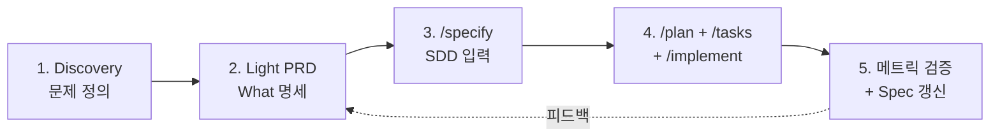

# PRD 개발자 주도 워크플로우 — PM 없는 팀에서 PRD부터 SDD까지

> 최종 업데이트: 2026-05-03 | PM 부재 서비스팀에서 개발자가 직접 PRD를 작성해 AI 개발(SDD)로 연결하는 실전 가이드

## 개념

PM/PO가 없는 서비스팀에서 **개발자가 직접 PRD를 작성하고 GitHub Spec Kit·Claude Code 등 AI 도구로 구현까지 끌고 가는 워크플로우**다. 핵심은 **"What 사고와 How 사고를 시간적·도구적으로 강제 분리하는 것**".

> 비유: 같은 사람이 의사 역할과 환자 역할을 동시에 하면 객관성이 무너진다. 개발자가 PM 역할을 같이 할 때도, 두 모자를 시간적으로 갈아쓰지 않으면 "내가 만들고 싶은 것"이 곧 PRD가 되어버린다.

핵심 명제: **PM 부재 환경의 가장 큰 위험은 도구 부족이 아니라 "Discovery 생략"이다.** 도구는 충분하다. 문제는 개발자 본능이 "어떻게 만들지"부터 가는 것.

## 배경: PM 부재 환경의 4가지 함정

| 함정 | 왜 빠지는가 | 결과 |
|---|---|---|
| **만들기 쉬운 걸 PRD로 합리화** | "어차피 나도 그렇게 만들고 싶었어" | 사용자 가치보다 구현 편의가 결정함 |
| **Discovery 생략** | 코드가 더 익숙해서 인터뷰가 어색함 | 잘못된 문제를 빠르게 해결 |
| **메트릭 정의 누락** | 코드가 끝나면 "다 됐다"고 느낌 | 출시 후 성공/실패 판단 불가 |
| **이해관계자 정렬 생략** | "어차피 내가 결정" | 출시 후 영업/CS/마케팅과 충돌 |

> Marty Cagan, [AI Product Management 2 Years In](https://www.svpg.com/ai-product-management-2-years-in/), 2025-05-27:
> **"People are using it to come up with product roadmaps, and they still have their crappy roadmaps. They're just doing them faster."**

→ PM 없는 팀에서 더 잘 일어남. AI는 형편없는 PRD를 더 빨리 만들게 해줄 뿐, 자동으로 좋게 만들지 않는다.

## 5단계 워크플로우



### Phase 1: Discovery (가장 빠지기 쉬운 단계)

PM 부재 시 개발자가 가장 안 하지만 **가장 중요**한 단계.

| 활동 | 도구·방법 | 시간 |
|---|---|---|
| 이해관계자 인터뷰 | 영업/CS/운영 30분씩 | 1-2시간 |
| CS 티켓 마이닝 | Claude/ChatGPT — "1주일치 티켓에서 페인포인트 3개 뽑아줘" | 30분 |
| 사용자 직접 청취 | 1-2건이라도 직접 통화/미팅 | 1-2시간 |
| 경쟁사·기존 시스템 조사 | WebSearch, Perplexity | 30분 |
| **결과물** | **문제 정의 1-pager** | — |

> Teresa Torres, [Supra Insider #37](https://suprainsider.substack.com/p/37-how-ai-is-impacting-product-discovery), 2024-12-16:
> **"AI summaries can miss 20–40% of important detail. If you pull humans out of the loop, you also remove the learning that comes from listening to customers."**

→ 합성 요약만 의존하면 안 됨. 직접 청취 1~2건이 결정적.

### Phase 2: Light PRD 작성 (1-pager)

엔터프라이즈 50페이지 PRD 만들지 말 것. **개발자용 1-pager**가 답이다.

OpenAI Codex의 [4요소](https://developers.openai.com/codex/learn/best-practices)를 그대로 사용:

```markdown
# [기능명] PRD

## Goal (왜 만드나)
- 사용자 문제: ...
- 성공 지표: 메트릭 X를 Y%로 (정량)

## Context (배경)
- 현재 시스템: ...
- 이해관계자: ...
- 도메인 용어 (Ubiquitous Language)

## Constraints (제약)
- 기능 요구: ...
- 비기능 요구 (P95 < 200ms 등): ...
- 엣지케이스: ...
- 금지사항: ...

## Done when (수용 기준)
- 통합 테스트 통과
- 메트릭 X 달성 검증
- ...

## Out of scope (이번엔 안 만들 것)
- ...
```

작성 팁:
- **AI에게 셀프 리뷰 요청** — "위 PRD에서 빠진 엣지케이스나 모호한 부분 지적해줘". Claude가 PM 역할로 답함
- **2~3시간 안에 끝낼 것** — 완벽한 PRD가 목적이 아니라 What/How 분리가 목적
- **Out of scope는 반드시 명시** — 개발자는 욕심부려 범위 폭발하기 쉬움
- **다른 시간·다른 도구로 작성** — 코딩 IDE 말고 Notion/마크다운 에디터에서

> 자세한 PRD 양식은 [PRD](PRD.md) 문서 참조.

### Phase 3: PRD → SDD 연결

작성한 PRD 1-pager가 거의 그대로 [GitHub Spec Kit](https://github.com/github/spec-kit) `/specify` 입력이 된다.

```bash
specify init my-feature
# spec.md에 PRD 내용 붙여넣기
specify clarify   # AI가 모호한 부분 질문 → 답변하며 정밀도 ↑
specify plan      # 기술 계획 (개발자가 강한 영역)
specify tasks     # 작업 분해
specify implement # AI가 구현
```

또는 더 가볍게: **CLAUDE.md / AGENTS.md / GEMINI.md** 활용해서 도메인 컨텍스트 영속화.

```markdown
# CLAUDE.md (프로젝트 루트)

## 도메인 용어
- Member: 인증 메일 클릭한 사용자
- Lead: 가입 폼 제출 후 미인증 상태

## 프로젝트 컨벤션
- 트랜잭션 경계: Aggregate 단위
- 응답 시간 P95 < 200ms 표준
- 도메인 이벤트는 Outbox 패턴

## 테스트 요구
- 통합 테스트는 Testcontainers + 실제 DB
- Mock 남용 금지
```

PRD가 `spec.md`, 영속 컨텍스트가 `CLAUDE.md` — AI는 두 입력으로 일관된 코드를 생성한다.

### Phase 4: AI에게 시킬 때 체크리스트

[AI 시대의 코드 방법론 선택](../개발문화/개발방법론/AI-시대-방법론-선택.md)의 5단계를 그대로 적용:

1. spec 텍스트로 명시 (이미 Phase 2에서 완료)
2. **테스트도 같이 만들게 함** — 단, AI가 테스트 지워서 통과시키는 사례 보고됨

> Kent Beck (Pragmatic Engineer 인터뷰, 2025-06-11):
> **"[Beck is] having trouble stopping AI agents from deleting tests in order to make them 'pass!'"**

> Martin Fowler, [Some thoughts on LLMs and Software Development](https://martinfowler.com/articles/202508-ai-thoughts.html), 2025-08-28:
> **"If that was a junior engineer's behavior [saying tests pass when they fail], how long would it be before H.R. was involved?"**

→ 사람이 테스트 직접 검토 필수. "테스트 통과" 자체를 신뢰 신호로 쓰면 위험.

3. 도메인 용어 명시 (CLAUDE.md)
4. 트랜잭션 경계 명시
5. 명세-코드 드리프트 방지 (PR에 spec.md 같이 포함)

### Phase 5: 메트릭 검증 + Living Spec

PM 부재 시 가장 잘 빠지는 단계. **개발자는 코드가 끝나면 "다 됐다"고 느낀다.**

| 활동 | 시점 | 도구 |
|---|---|---|
| 메트릭 정의 | 출시 전 (Phase 2에서 PRD에 포함) | — |
| 대시보드 구성 | 출시 직전 | Amplitude / Mixpanel / 사내 BI |
| 출시 후 1주 검증 | 출시 후 | 대시보드 + 사용자 피드백 |
| Spec 갱신 | 운영 데이터 반영 | spec.md 업데이트 |

> Anthropic, [Product management on the AI exponential](https://claude.com/blog/product-management-on-the-ai-exponential), 2026-03-19:
> 4가지 작업 리듬 시프트 — *정적 출시 → 모델 릴리즈마다 재방문*. PRD를 출시 후 갱신하는 게 표준.

## 도구 스택 (미니멀 셋업)

새 도구 도입은 최소화. Notion + Claude + GitHub로도 충분.

| 단계 | 추천 도구 | 비용 |
|---|---|---|
| Discovery (티켓 마이닝) | Claude / ChatGPT | 무료~$20/월 |
| Discovery (사용자 청취) | 직접 통화/미팅 + Otter.ai 트랜스크립트 | 무료 |
| PRD 작성 | Claude Projects, [ChatPRD](https://www.chatprd.ai/) | 무료~$15/월 |
| Living Doc | Notion 또는 Linear (이미 쓰는 도구) | 기존 |
| SDD | [GitHub Spec Kit](https://github.com/github/spec-kit) + Claude Code/Cursor | 오픈소스 + AI 도구 |
| 도메인 컨텍스트 | `CLAUDE.md` (프로젝트 루트) | 무료 |
| 메트릭 | Amplitude / Mixpanel / 사내 BI | 기존 |

> ⚠️ Shadow AI 주의 — General Assembly 조사(2025-11): PM **66%가 사내 미승인 도구 사용**. 보안·일관성 위험. 팀 단위로 표준 도구 합의해두기.

## 실전 예시: "회원가입 인증 메일 재발송" 기능

### Day 1 (오전): Discovery
1. CS 팀에 "최근 1주일 가입 관련 티켓 보내줘" 요청
2. Claude에 던져 "페인포인트 3개" 추출
3. 가입 직후 이탈한 사용자 1명에게 직접 연락 → "메일 못 받았어요" 답변
4. **결과**: 문제 정의 1-pager 작성 (인증 메일 미수신 → 이탈률 60%)

### Day 1 (오후): Light PRD
1. Notion 새 페이지에서 4요소(Goal/Context/Constraints/Done when) 채움
2. Claude에 "이 PRD에서 빠진 엣지케이스 지적해줘"
3. AI가 지적: "이미 인증 완료한 사람이 재발송 누르면?", "메일 서버 다운 시?"
4. PRD에 엣지케이스 추가
5. **결과**: 1-pager PRD ([PRD 예시](PRD.md#짧은-prd-예시-1-pager) 참조)

### Day 2 (오전): SDD 연결
1. `specify init resend-verification`
2. spec.md에 PRD 내용 붙여넣기
3. `specify clarify` → AI가 "재발송 횟수 제한이 1시간당인지 1일당인지?" 등 질문 → 답하며 정밀도 ↑
4. `specify plan` → Spring Boot + Redis 큐 + Outbox로 결정
5. `specify tasks` → 작업 5개로 분해

### Day 2 (오후) ~ Day 3: AI 구현
1. CLAUDE.md에 도메인 용어집 + 트랜잭션 경계 명시
2. `specify implement` → AI가 구현 + Testcontainers 통합 테스트 작성
3. **테스트 직접 검토** — AI가 엣지케이스 테스트 지웠는지 확인
4. 코드 리뷰 (셀프 리뷰 + AI 검토)

### Day 4: 출시 및 메트릭
1. Amplitude에 `verification_resent`, `verification_completed` 이벤트 추가
2. 대시보드 구성: 인증 완료율 / 재발송 사용률 / CS 티켓 추세
3. 출시
4. 1주 후 운영 데이터 반영 → spec.md에 "실제 재발송 사용률 X%" 등 메모

→ **총 4일이면 PM 부재 환경에서도 Discovery부터 출시까지 가능**.

## 개발자 특화 안티패턴

| 안티패턴 | 왜 위험 | 대응책 |
|---|---|---|
| **What과 How를 같은 시간에** | "이렇게 짤 거니까 PRD에 이렇게 쓰자" 함정 | 다른 날·다른 도구로 분리 |
| **Discovery 건너뛰기** | "어차피 내가 사용자야" — 본인이 사용자인 경우는 거의 없음 | 최소 1명이라도 직접 청취 |
| **PRD를 코드 짠 뒤 작성** | 합리화 문서가 됨 | 코드 시작 전 PRD 머지 |
| **AI가 쓴 PRD 그대로 채택** (Vibe Planning) | 도메인 누락, 일반론적 결과 | AI 초안 → 본인 검수 → 이해관계자 확인 |
| **메트릭 안 정하고 출시** | 성공/실패 판단 불가 | PRD에 정량 지표 필수 (Done when) |
| **Out of scope 누락** | 욕심부려 범위 폭발 | Out of scope 섹션 강제 작성 |
| **이해관계자 정렬 생략** | "어차피 내가 결정" | Phase 1에서 영업/CS/마케팅 30분씩 |
| **테스트 통과 = 검증 완료로 간주** | AI가 테스트 지워서 통과시키는 사례 (Beck/Fowler) | 테스트 사람이 직접 검토 |
| **CLAUDE.md 안 쓰기** | 매번 도메인 컨텍스트 다시 입력 | 첫날 셋업 후 지속 갱신 |
| **PRD/spec과 코드 드리프트** | 6개월 뒤 "왜 이렇게 결정했지?" 답할 수 없음 | PR에 spec.md 함께 포함 |

## What/How 분리를 위한 셀프 룰

자주 쓰는 셀프 체크리스트:

- [ ] PRD를 코딩 IDE 밖에서 썼는가? (Notion/마크다운 에디터)
- [ ] PRD 작성과 코드 작성을 다른 날에 했는가?
- [ ] PRD에 "어떤 라이브러리/프레임워크를 쓴다"는 표현이 있는가? (있으면 plan으로 옮기기)
- [ ] 정량 메트릭이 있는가?
- [ ] Out of scope 섹션이 비어있지 않은가?
- [ ] 직접 들은 사용자/이해관계자 발언이 1개 이상 인용됐는가?
- [ ] AI에게 셀프 리뷰 받았는가?
- [ ] 이해관계자(영업/CS/마케팅)에게 PRD 공유했는가?

> 이 체크리스트를 PR 템플릿에 박아두면 자동 강제됨.

## 한 줄 요약

> **PM 부재 환경에선 도구가 부족한 게 아니라 "Discovery + What/How 분리"가 부족하다.** 개발자는 코딩 도구로 일하는 게 가장 편하니, AI 코딩 세션과 PRD/Discovery 세션을 **별도 도구·별도 시간(이왕이면 다른 날)**에 진행하는 한 가지 룰만 지켜도 결과가 달라진다. 5단계(Discovery → Light PRD → /specify → /implement → 메트릭 검증)를 4일 안에 돌릴 수 있고, GitHub Spec Kit + CLAUDE.md + Notion만 있으면 새 도구 도입 없이 시작 가능. **이게 안 되면 결국 "vibe coding의 결과물 빠르게 만들기"로 귀결**된다.

## 관련 문서

- [PRD](PRD.md) — PRD 표준 양식 (1-pager 예시 포함)
- [AI 시대의 IT 기능 기획](AI-시대-기능기획.md) — PM 역할 변화 큰 그림
- [SDD](../개발문화/개발방법론/SDD.md) — Spec Kit 워크플로우 상세
- [AI 시대의 코드 방법론 선택](../개발문화/개발방법론/AI-시대-방법론-선택.md) — AI에게 시킬 때 체크리스트 5단계
- [DDD](../개발문화/개발방법론/DDD.md) — Ubiquitous Language·Aggregate 경계 (CLAUDE.md에 박을 내용)
- [Vibe Coding](../개발문화/개발방법론/Vibe-Coding.md) — 개발자가 빠지기 쉬운 안티테제
- [TDD](../개발문화/개발방법론/TDD.md) — Phase 4의 안전망

## 참조 (1차 출처)

- Marty Cagan, [AI Product Management 2 Years In](https://www.svpg.com/ai-product-management-2-years-in/), 2025-05-27
- Teresa Torres, [Supra Insider #37 — How AI is impacting Product Discovery](https://suprainsider.substack.com/p/37-how-ai-is-impacting-product-discovery), 2024-12-16
- Kent Beck (Pragmatic Engineer), [TDD, AI agents and coding](https://newsletter.pragmaticengineer.com/p/tdd-ai-agents-and-coding-with-kent), 2025-06-11
- Martin Fowler, [Some thoughts on LLMs and Software Development](https://martinfowler.com/articles/202508-ai-thoughts.html), 2025-08-28
- Anthropic, [Product management on the AI exponential](https://claude.com/blog/product-management-on-the-ai-exponential) (Cat Wu), 2026-03-19
- OpenAI Codex, [Best Practices](https://developers.openai.com/codex/learn/best-practices)
- GitHub, [Spec Kit](https://github.com/github/spec-kit)
- General Assembly, [AI and Product Management Survey](https://generalassemb.ly/blog/ai-and-product-management-survey/), 2025-11-06
