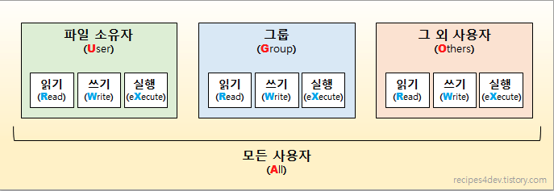

# chmod

## 리눅스에서의 파일 작업 

1. 파일에 저장된 데이터를 읽기 r 
2. 파일에 데이터를 쓰기 w
3. 파일 실행 x 

 리눅스에서는 각 파일 및 디렉토리에 대해 r, w, x 권한을 개별적으로
 지정할 수 있도록 만듦. 

 이 세가지 권한을 파일을 소유한 사용자(user), 특정 그룹에 소속된 사용자(group), 그 외 사용자(others)에 대해 각각 지정 가능.

## chmod란? 

    change + mode = chhmod

    * mode 란? 
    r, w, x 권한 및 사용자 U, G, O 에 대한 설정값을 통틀어서 지칭하는 단어.

    즉, chmod 명령을 사용하여 파일의 mode를 변경한다. 
    파일의 권한을 변경한다.

## 참고 
https://recipes4dev.tistory.com/175
